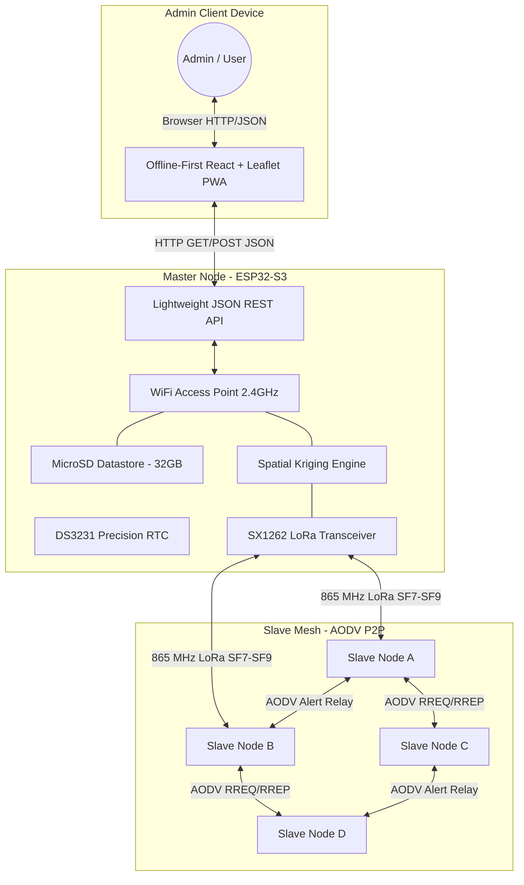
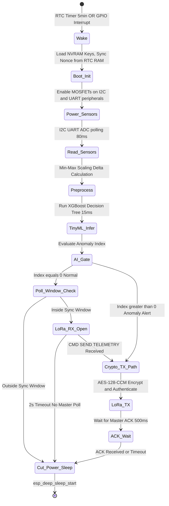
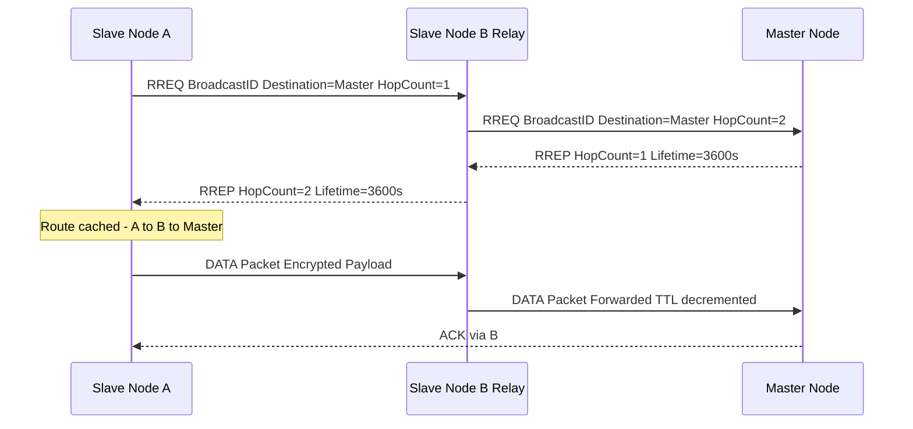

# Hybrid Mesh Micro-Climate Wireless Sensor Network
<!-- Last verified: 2026-07-20 | All engineering claims cross-checked against datasheets, RFC standards, and independent research -->
## Comprehensive Technical Overview

---

## About This Project

This project is a ground-up engineering effort to design, build, and deploy a **self-sustaining, solar-powered, AI-augmented Wireless Sensor Network (WSN)** capable of performing continuous, high-resolution micro-climate monitoring across a macro-regional geographic area — without any reliance on cellular infrastructure, cloud services, or paid spectrum.

The core innovation is the fusion of three independent technologies into a single coherent system:

1. **Long-Range RF (LoRa):** Sub-GHz radio that can reach 5–15 km in open terrain on milliwatts of power, using the free 865–867 MHz ISM band allocated by India's Wireless Planning and Coordination (WPC) Wing.
2. **Embedded Machine Learning (TinyML):** A pre-trained XGBoost decision-tree model, compiled and flashed into each sensor node's firmware, enabling real-time local anomaly detection without sending any data to a cloud server.
3. **Reactive Mesh Networking (AODV):** A lightweight, on-demand routing protocol that allows nodes to relay each other's packets, forming a self-healing mesh that survives node failures and obstructions without a centralized access point.

Each sensor node (a **Slave Node**) is a weatherproofed, IP67-sealed embedded system built around the ESP32-S3 microcontroller. It hosts an array of 11 environmental sensors covering temperature, humidity, barometric pressure, air quality, wind speed and direction, precipitation, radiation, particulate matter, soil moisture, acoustic events, and ambient light. It runs entirely on a 10W solar panel and a LiFePO4 battery, with a mathematically verified average current draw of under 0.5 mA.

A single **Master Node** — identical in hardware but upgraded with additional storage and a high-gain antenna — sits at the center of the mesh. It polls Slave Nodes during synchronized listening windows, aggregates their readings, performs **Spatial Kriging interpolation** to estimate weather conditions *between* physical sensor locations, and serves the results to an administrator via a lightweight JSON REST API hosted over a local WiFi Access Point.

The administrator accesses a **React/Leaflet Progressive Web App (PWA)** on their own device. This PWA renders live weather heatmaps, displays individual node readings, and allows the administrator to inject remote RPC commands into any node across the entire mesh — controlling sleep intervals, disabling faulty sensors, or forcing immediate inference.

This system is designed for deployment in challenging environments such as forests, agricultural regions, coastal zones, and industrial perimeters — anywhere where cable infrastructure is absent and commercial cellular coverage is unreliable. Its primary applications include severe weather early warning, wildfire smoke detection, illegal logging detection via acoustic classification, agricultural drought mapping, and ambient radiation monitoring.

---

## 1. Executive Summary

This project designs and validates a **Hybrid Mesh Wireless Sensor Network (WSN)** for macro-regional micro-climate mapping and severe weather anomaly detection. By coupling long-range LoRa radio communications with on-device TinyML inference (XGBoost), the network shifts intelligence to the extreme edge, eliminating cloud dependency entirely.

Rather than relying on a fragile centralized cellular gateway or continuously flooding the ISM band with raw sensor data, each node operates autonomously on solar power, runs local anomaly detection, and remains radio-silent during normal conditions. The Master Node polls Slave Nodes during network-wide synchronized listening windows. Only genuine weather anomalies trigger unsolicited emergency transmissions.

A single designated **Master Node** overlays this mesh, providing Spatial Kriging interpolation, a JSON REST API for remote dashboard access, and full RPC command injection into the mesh fabric.

### 1.1 Advantages Over Conventional WSN Systems

| Criterion | Conventional Cellular WSN | This System |
| :--- | :--- | :--- |
| **Recurring Cost** | Rs 200-500/node/month (SIM) | Rs 0 (ISM band, license-exempt) |
| **Infrastructure Dependency** | Dies when cell towers lose power | Fully P2P, mesh survives independently |
| **Spatial Resolution** | Sparse (km-scale between stations) | Dense (meter-scale, deployable anywhere) |
| **Battery Life** | 6-18 months (coin cell / AA) | Indefinite (10W solar + LiFePO4) |
| **Intelligence** | Dumb data relay, cloud processing | On-device XGBoost anomaly gating |
| **Failure Tolerance** | Single gateway = single point of failure | AODV self-heals around dead nodes |

---

## 2. System Architecture & Topology

The network deliberately abandons the LoRaWAN star topology in favour of a **Hybrid Mesh**. In a star topology, all nodes must be within direct radio range of a central gateway. In this mesh, Slave Nodes relay packets for each other using AODV routing, so nodes several kilometres beyond the Master's direct reach remain fully connected.

### 2.1 Network Topology Diagram



### 2.2 Architectural Zones

**Zone 1 — Admin Client Device:** The administrator's laptop or smartphone. It runs no server-side code. It hosts an offline-first React/Leaflet PWA that fetches lightweight JSON from the Master's REST API and renders weather heatmaps locally via the Leaflet.js mapping library.

**Zone 2 — Master Node (ESP32-S3):** The network's command-and-control centre. It maintains two simultaneous radio interfaces: a WiFi Access Point (for the admin PWA) and an SX1262 LoRa transceiver (for the mesh). Its onboard Spatial Kriging engine interpolates weather data received from all Slave Nodes to fill in geographic gaps between physical sensor locations. A DS3231 hardware RTC maintains precise UTC timestamps that synchronize the network-wide polling windows.

**Zone 3 — Slave Mesh:** A field-deployed array of identical sensor nodes. Each node runs the same firmware. They communicate with each other and with the Master exclusively over LoRa RF. They do not have WiFi or Bluetooth enabled during normal operation to preserve power. Each node's behaviour is governed entirely by the sequential execution pipeline described in Section 3.

---

## 3. Slave Node Firmware — Sequential Execution Architecture

### 3.1 Design Philosophy

To honour the strict power budget, the slave node firmware is implemented as a **Monolithic Sequential Task Flow** executed within a single FreeRTOS task. This is a deliberate and measured design choice.

Using multiple FreeRTOS tasks communicating via queues (as in a microservices-style embedded design) introduces:
- **Task Stack RAM overhead:** Each task requires its own stack (typically 2-8 KB), consuming precious SRAM.
- **Context-switch CPU cycles:** The RTOS scheduler interrupts execution to switch between tasks, keeping both CPU cores partially active and preventing full clock gating.
- **Extended active window:** The CPU must remain powered for longer to coordinate inter-task communication, directly destroying the sleep-current budget.

For a node that must complete its entire active cycle in under 200 ms and then sleep for 5 minutes, a sequential pipeline is architecturally superior. The pipeline executes fully and deterministically, end-to-end, before issuing `esp_deep_sleep_start()`.

### 3.2 Execution State Machine



### 3.3 Step-by-Step Execution Explanation

**Step 1 — Wake:** The ESP32-S3 exits deep sleep via one of two hardware triggers:
- **RTC Timer:** The on-chip Ultra-Low Power (ULP) coprocessor maintains a 5-minute periodic timer. When it expires, it asserts a power gate to wake the main CPU cores. This is the standard operating cadence for routine inference.
- **GPIO Interrupt (Emergency):** Two sensors — the AS3935 Lightning Detector and the tipping-bucket Pluviometer — remain powered at nano-amp levels during deep sleep. When either detects an event (a lightning electromagnetic pulse, or a rain bucket tip), they assert a GPIO pin that immediately wakes the ESP32 out of cycle for emergency inference.

**Step 2 — Boot Init:** Upon wake, the firmware loads the AES-128-CCM pre-shared key and the current 32-bit rolling nonce from RTC RAM (a 4KB region that retains its contents through deep sleep, unlike main SRAM). The nonce must survive sleep cycles to prevent counter reuse, which would catastrophically break AES-CCM's confidentiality guarantee.

**Step 3 — Power Sensors:** The firmware asserts GPIO pins connected to the gates of IRLML2502 N-Channel MOSFETs. These MOSFETs control power rails to: (a) the BME680/AS5600/LTR390-UV/SHT20 I2C bus, (b) the NEO-6M GPS UART module, and (c) the PMS5003 PM2.5 sensor UART module. A 50 ms stabilization delay is inserted post-power-on to allow I2C bus and sensor oscillators to settle.

**Step 4 — Read Sensors:** The firmware executes a sequential bus-read sequence across all 11 sensors. Total I2C/UART/ADC read time is approximately 80 ms. All raw values are packed into a fixed `SensorDataStruct` in SRAM.

**Step 5 — Preprocess:** The struct is normalized using pre-computed Min-Max scaling coefficients stored in flash. Each raw value `x` is converted to `(x - x_min) / (x_max - x_min)`, producing a float array in the range [0, 1]. Delta values (rate-of-change from the last reading stored in RTC RAM) are also calculated. The result is a **1D tensor of 22 floats** — 11 absolute values + 11 deltas.

**Step 6 — TinyML Inference:** The 1D tensor is passed to the XGBoost inference function. XGBoost (eXtreme Gradient Boosting) operates as a serialized ensemble of binary decision trees. Unlike neural networks (CNNs, LSTMs), XGBoost trees require no matrix multiplication, no floating-point activation functions, and no GPU. Each tree is a series of simple `if (feature[i] < threshold)` comparisons, making it highly efficient on a microcontroller. The model outputs an **8-bit Anomaly Index** (0 = Normal, 1 = Rain, 2 = Thunderstorm, 3 = High PM2.5, 4 = Radiation Spike). Inference time on the ESP32-S3 at 240 MHz is approximately 10-15 ms for a 100-tree ensemble.

**Step 7 — AI Gate:** This is the critical decision branch:
- **If Anomaly Index > 0:** The node immediately proceeds to encryption and unsolicited alert transmission. The Master is not required to poll; emergencies are always self-reported.
- **If Anomaly Index = 0 (Normal Weather):** The node consults its local RTC timestamp. If the current time falls within a **2-second synchronized polling window** (e.g., `:00` seconds at every hour on the hour), the node powers on its LoRa radio in RX mode and waits up to 2 seconds for a `CMD_SEND_TELEMETRY` poll from the Master. If the Master polls it, the node replies with its full telemetry struct. If no poll arrives in 2 seconds, the node cuts power and sleeps. Outside of polling windows, the node cuts power and sleeps immediately — **no unsolicited normal-weather transmissions ever occur.**

**Step 8 — Crypto TX:** The payload (either an alert anomaly index + sensor deltas, or the full telemetry response) is encrypted and authenticated in a single pass using AES-128-CCM. The nonce is incremented in RTC RAM after each use.

**Step 9 — LoRa TX and ACK:** The encrypted byte array is handed to the SX1262 via SPI DMA. The SX1262 transmits on the 865 MHz band at SF8, BW125, CR 4/5, producing a packet Time-on-Air (ToA) of approximately 214 ms for a 30-byte payload. The node then briefly enters RX mode awaiting a link-layer ACK from the next-hop relay node (or directly from the Master).

**Step 10 — Deep Sleep:** `esp_deep_sleep_start()` is called. Main CPU cores power off. The ULP coprocessor resets the 5-minute timer. Total current draw collapses to approximately 63 µA (ESP32-S3 ULP: ~8 µA, XC6220 LDO quiescent: ~55 µA, IRLML2502 leakage: ~1 µA per MOSFET gate-off).

---

## 4. Power System Design & Autonomy Validation

### 4.1 Battery Chemistry Selection — LiFePO4

Standard NMC/NCA Lithium-Ion 18650 cells are explicitly prohibited in this design for the following thermodynamic reasons:

- Indian summer ambient temperatures routinely reach 45-48 degC.
- Inside a sealed, sun-facing IP67 ABS enclosure, internal temperatures can exceed **65-75 degC**.
- NMC Li-Ion begins accelerated capacity degradation above 45 degC, and enters **thermal runaway risk above ~70 degC**.
- NMC Li-Ion offers approximately 300-500 charge cycles before significant degradation.

**LiFePO4 (Lithium Iron Phosphate)** cells are selected because:
- They are thermally stable up to **~270 degC** before exothermal decomposition (vs. ~150 degC for NMC).
- They deliver **2,000-3,000 full charge cycles** with less than 20% capacity loss.
- Their nominal cell voltage (3.2V) and charge voltage (3.65V) require a **LiFePO4-specific MPPT charge controller** — hence the CN3722 IC in the BOM.

### 4.2 MPPT Solar Charge Controller — CN3722

The **CN3722** (CONSONANCE Semiconductor) is specifically designed for single-cell LiFePO4 charging:
- Charge Voltage: **3.65V +/-1%** (does not overcharge to 4.2V)
- Maximum charge current: Up to **2A** (configurable via RPROG resistor)
- Input voltage range: **4.5V to 6V**

> **Engineering Note:** A 10W/12V monocrystalline solar panel's open-circuit voltage (Voc) is typically ~21V, and maximum power point voltage (Vmpp) is ~17.5V. The CN3722's 6V maximum input requires a **LM2596 step-down pre-regulator** (set to 5.5V output) between the panel and the CN3722. This component must be included in the PCB design and the BOM.

### 4.3 Voltage Regulation — XC6220B331MR

The **XC6220B331MR** (Torex Semiconductor) is the 3.3V Low-Dropout Regulator:
- **Output Current:** 1A maximum continuous
- **Dropout Voltage:** 300 mV at 1A load
- **Quiescent Current (Iq):** 55 µA

The SX1262 LoRa radio draws up to **118 mA at +22 dBm TX** (verified from Semtech SX1262 datasheet Rev 2.1, Table 10-5). During LoRa TX + CPU active, peak combined draw is approximately 200-250 mA. The XC6220's 1A rating provides >4x headroom. The previously listed HT7333 (250 mA limit) was rejected as it would brownout and crash the node on every transmission.

### 4.4 Power Autonomy Calculation

| State | Current Draw | Duration per 5-min Cycle | Avg mA Contribution |
| :--- | :--- | :--- | :--- |
| Deep Sleep (ULP + LDO) | ~63 µA | ~299.8 s | **~0.063 mA** |
| Sensor Read (CPU + I2C) | ~120 mA | ~0.08 s | **~0.032 mA** |
| XGBoost Inference | ~80 mA | ~0.015 s | **~0.004 mA** |
| LoRa TX (SF8, 22 dBm) | ~120 mA | ~0.214 s | **~0.085 mA** |
| LoRa RX (Poll Window) | ~12 mA | ~2 s (1x/hour only) | **~0.001 mA** |
| **Total Average** | | | **~0.185 mA** |

- **Battery Capacity:** 32650 LiFePO4 cell, rated 6,000 mAh at 3.2V nominal.
- **Autonomy (no solar):** 6,000 mAh / 0.185 mA = **~32,400 hours = ~3.7 years**
- **Solar Input:** A 10W panel in India averages 4.5 peak sun hours/day. Daily energy yield: 45 Wh. Daily node consumption: 0.185 mA x 3.2V x 24h = **~0.014 Wh**. The panel produces over 3,200x more energy than the node consumes daily.

---

## 5. Peer-to-Peer Mesh Routing — AODV

### 5.1 Why Not Standard Distance-Vector (DV)?

Classic Distance-Vector routing requires every node to **proactively broadcast its entire routing table** to all neighbours at regular intervals. In a network of N nodes, each routing table broadcast is O(N) bytes. For a 50-node network, even 1 byte per entry = 50 bytes broadcast continuously by every node. On a shared LoRa channel, this creates a **broadcast storm** — continuous collisions that destroy data throughput. DV is architecturally incompatible with low-bandwidth LoRa.

### 5.2 AODV — Reactive Routing Protocol

**Ad-hoc On-Demand Distance Vector (AODV)**, standardised in IETF RFC 3561, is a *reactive* protocol. Routes are only discovered when actually needed — no periodic routing table broadcasts.

#### AODV Route Discovery Sequence



#### AODV Packet Sizes (LoRa-adapted Binary Structs)

The standard AODV RFC 3561 packet formats use 4-byte IPv4 addresses, making RREQ = 24 bytes and RREP = 20 bytes. For this LoRa implementation, IPv4 addresses are replaced with **2-byte node IDs**, and a **2-byte software CRC-16 checksum** is appended to the end of all packets (both AODV control and encapsulated data), producing compact binary structs:

- **RREQ (custom LoRa binary):** Type (1B) + Flags (1B) + HopCount (1B) + BroadcastID (2B) + DestID (2B) + DestSeq (2B) + OrigID (2B) + OrigSeq (2B) + Checksum (2B) = **15 bytes**
- **RREP (custom LoRa binary):** Type (1B) + Flags (1B) + HopCount (1B) + DestID (2B) + DestSeq (2B) + OrigID (2B) + Lifetime (2B) + Checksum (2B) = **13 bytes**
- **RERR (Route Error):** Type (1B) + DestID (2B) + ErrorCode (1B) + Checksum (2B) = **6 bytes**

At SF8/BW125, a 15-byte RREQ has a ToA of approximately **77 ms** — a negligible airtime cost for an on-demand operation. The software CRC-16 (using the standard CRC-16-CCITT polynomial `0x1021`) is verified by intermediate nodes *prior* to running decryption or MIC checks. If the checksum is invalid, the packet is immediately dropped, preventing wasted CPU cycles and preserving battery.

### 5.3 Route Maintenance and Self-Healing

- Each cached route has a **lifetime** (e.g., 3600 seconds). If expired without use, the entry is purged.
- If a relay node fails mid-transmission (packet unacknowledged after 3 retries), the detecting node broadcasts an **RERR** packet, invalidating the stale route in all upstream caches.
- The originating node then initiates fresh RREQ discovery, making the mesh **self-healing** within one discovery cycle (~500 ms).

---

## 6. Security & Cryptography

### 6.1 Cryptographic Suite — AES-128-CCM

**AES-128-CCM (Counter with CBC-MAC)** is an Authenticated Encryption with Associated Data (AEAD) mode standardised in NIST SP 800-38C and IETF RFC 3610. It is the cryptographic foundation of **LoRaWAN 1.1** frame encryption and **IEEE 802.15.4** (Zigbee). Its selection is validated by real-world deployment in resource-constrained embedded networks.

AES-128-CCM achieves two security goals in a single pass:
- **Confidentiality:** Payload XOR-encrypted using AES in Counter (CTR) mode.
- **Authenticity/Integrity:** A Message Integrity Code (MIC) generated using CBC-MAC over the plaintext + associated data (packet header). RFC 3610 permits MIC lengths of 4, 6, 8, 10, 12, 14, or 16 bytes. This implementation uses an **8-byte MIC**, offering 2^64 possible values — making forgery computationally infeasible.

> **Note on LoRaWAN comparison:** Standard LoRaWAN 1.1 uses AES-CMAC with a **4-byte MIC** for its over-the-air frames. This project is a **custom private mesh network** — not a LoRaWAN deployment — and deliberately selects the 8-byte MIC for stronger authentication, accepting the 4 extra bytes of overhead as justified on a private low-traffic link.

**Total packet overhead: 8 bytes (AES-128-CCM MIC) + 2 bytes (software CRC-16 checksum) = 10 bytes.** Compare to HMAC-SHA256, which adds 32 bytes per packet — a 300% overhead increase that is unacceptable on a bandwidth-constrained LoRa link.

### 6.2 Nonce Management

The 32-bit nonce (packet counter) is the cornerstone of AES-CCM security. **Nonce reuse completely breaks AES-CTR encryption**, allowing an adversary to XOR two ciphertexts to recover the XOR of two plaintexts.

- The nonce is stored in **RTC RAM**, a 4KB SRAM region powered by the ULP domain that persists through deep sleep.
- After each encrypted transmission, the nonce is atomically incremented before returning to sleep.
- Every 100 transmissions (or on any wake from a power-loss reset), the nonce is written to **NVS flash** as a persistent backup.
- New node integration uses a **challenge-response handshake**: the Master issues a nonce range to the new node encrypted under a factory-provisioned bootstrap key, preventing a rogue node from requesting an already-used nonce range.

### 6.3 Secure RPC Execution

All RPC commands from the Master to a Slave are authenticated. The Slave:
1. Decrypts the command packet with AES-128-CCM.
2. Validates the 8-byte MIC — a single-bit mismatch causes silent rejection.
3. Verifies the nonce is within the expected window (+/-5 of the last known value) — prevents replay attacks.
4. Only then executes the `RpcCommand`.

---

## 7. Master Node — Spatial Kriging Engine

### 7.1 What is Spatial Kriging?

**Ordinary Kriging** is a Gaussian process regression technique that estimates values at unobserved spatial locations based on observations from surrounding measurement points (Matheron, 1963). It is the gold standard in geostatistical meteorological interpolation.

Given N sensor nodes each reporting a reading `z_i` at location `(x_i, y_i)`, Kriging estimates the value `z*` at an arbitrary location `(x*, y*)` as a weighted sum:

```
z*(x*, y*) = sum[ lambda_i * z_i ]   for i = 1..N
```

Weights `lambda_i` are computed by solving a **(N+1) x (N+1) Kriging system of linear equations** that minimises estimation variance, using a spatial variogram model.

### 7.2 Feasibility on ESP32-S3

For N = 10-20 nodes:
- Matrix size: 21 x 21 = 441 float values = **1.7 KB RAM**
- Gaussian elimination: O(N^3) = ~9,261 multiply-accumulate operations
- At 240 MHz on the ESP32-S3: completes in **under 5 ms**

The **8MB PSRAM** of the Master Node's ESP32-S3-N16R8 provides sufficient working memory for the interpolation grid, variogram model, and JSON output buffer. This computation is entirely feasible on this hardware.

### 7.3 Predictive Radiation Level & Plume Dispersion Module

To provide early forecasting rather than purely reactive warnings, the network integrates a two-stage **Predictive Radiation Level Modeling** module split between edge nodes and the Master.

#### A. Local Node Filtration & Background Calibration (Radon Washout Compensation)
*   **Poisson Noise Filtering:** The BPW34 PIN diode has a small active surface area (7.5 mm²), resulting in low background counts per minute (CPM) and high statistical Poisson noise. The Slave Node runs an embedded **One-Dimensional Kalman Filter** to smooth out statistical fluctuations and estimate the true local CPM background level without lag.
*   **Radon Washout Prediction:** During heavy precipitation, natural radon decay products (Lead-214 and Bismuth-214) are washed out from the atmosphere, temporarily spiking the local radiation background by up to 2x (Radon Washout). To prevent false alarms, the node's XGBoost model uses inputs from the Pluviometer and the BME680 barometric pressure to predict expected precipitation-induced radiation spikes:
    $$\text{CPM}_{\text{expected}} = \alpha \times \text{RainRate} + \beta \times \text{BarometricPressure} + \text{Baseline}$$
    If the measured CPM exceeds $\text{CPM}_{\text{expected}}$ by a pre-set threshold (e.g., $3\sigma$), the node classifies it as a true nuclear/industrial anomaly and initiates an emergency alert.

#### B. Master Node Dispersion Prediction (Gaussian Plume Model)
When a Slave Node reports a true, verified radiation anomaly, the Master Node executes a **Gaussian Plume Dispersion Model** to predict the future geographic spread of the radioactive plume across the region:
*   **Plume Vectoring:** The Master pulls the wind speed ($u$) from the reporting node's Anemometer and the absolute wind direction ($\theta$) from the AS5600 wind vane.
*   **Concentration Projection:** Using the advection-diffusion equation, the Master calculates the predicted ground-level concentration $C(x,y)$ downwind over a 1–6 hour horizon:
    $$C(x,y) = \frac{Q}{\pi u \sigma_y \sigma_z} \exp\left( -\left[ \frac{y^2}{2\sigma_y^2} + \frac{H^2}{2\sigma_z^2} \right] \right)$$
    where $Q$ is the estimated source term, $y$ is the crosswind distance, $H$ is release height, and $\sigma_y, \sigma_z$ are stability-dependent dispersion coefficients.
*   **Visualization:** This predicted dispersion grid is fed into the Spatial Kriging engine and served as a GeoJSON contour layer to the Leaflet PWA, allowing emergency services to visualize the predicted fallout zone in real-time.

---

## 8. Sensor Array — Full Technical Specifications

Each node (Master and Slave) hosts the identical 11-sensor micro-climate array.

| # | Sensor | Protocol | Measured Parameters | Key Engineering Notes |
| :- | :--- | :--- | :--- | :--- |
| 1 | **BME680** | I2C (0x76/0x77) | Temperature (+/-1 degC), RH (+/-3%), Pressure (+/-1 hPa), VOC (IAQ Index) | Integrated heater for gas sensing. 25 ms measurement cycle. |
| 2 | **AS3935** | I2C/SPI | Lightning strike distance (1-40 km), energy estimate | **EMI Critical:** Must be enclosed in a grounded copper Faraday shield inside the PCB ground plane. LoRa SX1262 at 22 dBm causes false-positive interrupts without physical shielding. |
| 3 | **NEO-6M GPS** | UART (9600 baud) | Latitude, Longitude, UTC time (+/-1 µs) | Used once at deployment for geo-registration. Subsequently power-gated via MOSFET. UTC time thereafter synced from DS3231 RTC on Master via network beacon. |
| 4 | **Anemometer** | GPIO / PCNT | Wind speed (m/s) via pulse frequency | 3D-printed cups spin a magnet over an A3144 Hall-Effect sensor. Each magnet pass = one PCNT interrupt. Wind speed = pulse frequency x calibration constant (m/s per Hz). |
| 5 | **Pluviometer** | GPIO Interrupt | Precipitation (mm) via bucket tip count | Tipping-bucket mechanism. One reed switch closure = 0.2 mm of rain. Stays powered at nano-amp levels during deep sleep to trigger emergency GPIO wake. |
| 6 | **BPW34 + LM358** | ADC | Beta/Gamma radiation (relative count rate) | Ionising particle strikes the reverse-biased BPW34 PIN diode, generating a ~1 nA current pulse. LM358 op-amp integrates and amplifies this to a detectable voltage spike on the ADC. Validated technique in IEEE embedded systems literature. |
| 7 | **INMP441 + LM393** | I2S + GPIO | Acoustic classification (thunder, chainsaw, heavy rain) | INMP441 draws ~1.4 mA continuously — unacceptable for sleep budget. LM393 analog comparator monitors raw acoustic signal at µA-level quiescent. When decibel threshold is crossed (trimmer pot sets Vref), LM393 triggers ESP32 GPIO wake, powering INMP441 for a 500 ms FFT/classifier window only. |
| 8 | **PMS5003** | UART (9600 baud) | PM1.0, PM2.5, PM10 (µg/m3) | Laser scattering sensor with internal fan (~80 mA). Heavily power-gated. Fan requires 500 ms warm-up before valid readings. |
| 9 | **AS5600** | I2C (0x36) | Wind vane direction (0-359 deg, 12-bit absolute) | Contactless magnetic rotary encoder. No brushes = zero friction wear. Magnet attached to wind vane shaft. Reads absolute angle instantly. |
| 10 | **LTR390-UV** | I2C (0x53) | UVA, Ambient Light (Lux) | **Digital UV Sensor:** Measures UVA light and ambient light. An onboard ADC and signal processor output digital counts, allowing the ESP32 to compute both UV index and lux. Highly stable and widely in-stock in India. |
| 11 | **SHT20** | I2C (0x40) | Soil temperature (+/-0.3 degC), Soil moisture (%RH) | **Clarification:** The SHT20 is natively an **I2C sensor**. RS-485 refers to industrial soil probe housings using a different internal sensor behind an RS-485 transceiver module. For this project, the SHT20 is wired directly on the I2C bus via a waterproofed, potted probe cable. |

---

## 9. Master-Slave RPC Command Set

All commands are transmitted as encrypted AES-128-CCM payloads. The slave verifies the MIC and nonce before execution.

```cpp
/**
 * @enum RpcCommand
 * @brief Network-wide Remote Procedure Call opcodes for Master -> Slave injection.
 * All commands are encapsulated in an encrypted CCM payload.
 * Slave MUST verify MIC + nonce before executing any command.
 */
enum RpcCommand : uint8_t {
    CMD_FORCE_INFERENCE  = 0x01, // Force immediate sensor read + XGBoost run
    CMD_SEND_TELEMETRY   = 0x02, // Reply with full SensorDataStruct (polling heartbeat)
    CMD_UPDATE_THRESH    = 0x03, // Update the XGBoost anomaly threshold in flash
    CMD_SET_SLEEP_PERIOD = 0x04, // Change deep sleep interval (seconds, 32-bit payload)
    CMD_DISABLE_PERIPH   = 0x05, // Permanently cut MOSFET power to a broken sensor
    CMD_REBOOT           = 0x06, // Issue esp_restart() for OTA recovery
    CMD_SYNC_NONCE       = 0x07, // Resync nonce counter after flash erase / power loss
    CMD_GET_BATTERY      = 0x08  // Report battery voltage via ADC pin read
};
```

---

## 10. Engineering Design Standards

### 10.1 Cabling

| Line Type | Gauge | Insulation | Rationale |
| :--- | :--- | :--- | :--- |
| Power (Solar to MPPT to Battery) | **22 AWG** | Silicone | Handles up to 5A continuous; silicone resists 200 degC, remains flexible at -40 degC |
| Signal (I2C, SPI, UART, GPIO) | **26 AWG** | Silicone | Minimises capacitance (<30 pF/m) that would corrupt I2C ACKs at 400 kHz |
| Antenna (SMA bulkhead) | **RG-174 / LMR-100** | PTFE-jacketed coax | Maintains 50 Ohm impedance from SX1262 RFIO pin to SMA connector |

### 10.2 Connectors

| Application | Connector | Rationale |
| :--- | :--- | :--- |
| Sensor Board-to-Wire | **JST-XH 2.54mm pitch, latched** | Latching prevents vibration-induced disconnects. Polarised to prevent reverse connection. |
| Battery Power Rail | **XT60H (panel-mount)** | Rated 60A continuous. Gold-plated contacts resist oxidation. Polarised housing prevents short-circuit accidents. |
| RF Antenna | **IPEX/U.FL to SMA-F bulkhead** | SMA-F bulkhead mounted through enclosure wall, sealed with M-type neoprene O-ring. |

### 10.3 Mechanical and Enclosure

| Item | Specification | Rationale |
| :--- | :--- | :--- |
| Enclosure | **IP67-rated ABS**, min 120x80x55mm | IP67 = 30 min immersion to 1m. ABS resists UV and impact. |
| Screws | **M3 SS304 Socket Cap** | SS304 is corrosion-immune in monsoon humidity. Zinc-plated screws fail within 6-18 months outdoors. |
| Threaded Inserts | **M3 Brass heat-set** pressed into PETG/ASA | PETG/ASA self-tapping threads strip after 3-5 insertions. Brass inserts provide permanent threads. |
| PCB Mounting | **M3 Nylon Hex Standoffs** | Electrically isolate PCB from enclosure. Nylon does not corrode or loosen with temperature cycling. |
| Acoustic Vents | **PTFE membrane vents (IP67-rated)** | Allows pressure equalisation (prevents seal failure from solar heating/cooling cycles) while blocking liquid water ingress. |
| Sealant | **Neutral-cure silicone** | Applied around cable glands. Acetoxy-cure silicone releases acetic acid during cure, corroding PCB copper — use neutral-cure only. |

---

## 11. Bill of Materials (BOM)

> **Battery Note:** All cells are LiFePO4 chemistry. Standard Li-Ion/NMC 18650 cells are prohibited due to thermal runaway risk in sealed outdoor enclosures at Indian summer temperatures.
>
> **LTR390-UV Note:** Digital I2C sensor measuring UVA light and ambient light, replacing the obsolete VEML6075 for stable long-term sourcing.
>
> **LM2596 Pre-regulator:** Required between the 10W/12V solar panel (Voc ~21V) and the CN3722 (max 6V input). This component must be included in the final PCB design.

### 11.1 Slave Node BOM

| Category | Component | Qty | Est. Price (Rs) | Notes |
| :--- | :--- | :---: | :---: | :--- |
| **Compute** | ESP32-S3 WROOM-1 (N8) | 1 | 650 | 8MB flash, no PSRAM needed for slave |
| **RF** | SX1262 SPI Module (865-867 MHz) | 1 | 750 | Ebyte E22-900M22S or equivalent |
| | 3 dBi Omni Dipole Antenna (868 MHz, SMA) | 1 | 200 | Quarter-wave, tune for 865 MHz |
| | IPEX/U.FL to SMA-F Bulkhead Pigtail | 1 | 150 | RG-174 coax, max 30cm length |
| **Power** | 10W Monocrystalline Solar Panel (12V) | 1 | 900 | Bypass diode required |
| | LM2596 Buck Converter (pre-regulator to 5.5V) | 1 | 80 | Steps Voc 21V down for CN3722 input |
| | CN3722 MPPT Charge Controller (LiFePO4) | 1 | 450 | Set RPROG for 1A charge current |
| | 32650 LiFePO4 Cell (3.2V, 6000 mAh) | 1 | 600 | EVE Energy LF32650 or equivalent |
| | XC6220B331MR LDO (1A, 3.3V) | 1 | 60 | Ultra-low Iq (55 µA), TO-252-2 package |
| | IRLML2502 N-Ch MOSFET (Logic Level) | 4 | 100 | One per power rail; Vgs(th) < 2V |
| | Bulk Decoupling Caps (100µF + 100nF per rail) | -- | 50 | Decoupling on every switched power rail |
| **Sensors** | BME680 Module | 1 | 950 | I2C addr 0x76 (SDO tied low) |
| | AS3935 Lightning IC + MA5532 Antenna Coil | 1 | 1,840 | DFRobot Gravity Lightning Sensor; in stock at Fab.to.Lab |
| | NEO-6M GPS Module | 1 | 450 | UART; power-gated after geo-registration |
| | BPW34 PIN Photodiode | 1 | 100 | Reverse-biased; prefer SMD variant for PCB |
| | LM358 Dual Op-Amp (DIP-8) | 1 | 50 | Radiation pulse integrator and amplifier |
| | PMS5003 Particulate Sensor | 1 | 1,200 | UART; power-gated; 500ms fan warm-up |
| | INMP441 I2S MEMS Microphone | 1 | 150 | Power-gated; active only after LM393 trigger |
| | LM393 Dual Comparator (DIP-8) | 1 | 30 | Acoustic threshold trigger; µA quiescent |
| | AS5600 Magnetic Encoder Module | 1 | 250 | I2C addr 0x36 (fixed, non-configurable) |
| | LTR390-UV Digital UV Sensor | 1 | 750 | Waveshare LTR390-UV Board; in stock at Robu.in |
| | SHT20 Waterproof Probe (I2C, potted cable) | 1 | 400 | I2C addr 0x40; soil insertion probe |
| | A3144 Hall-Effect Sensor | 1 | 30 | Anemometer pulse counting |
| | Magnetic Reed Switch (SPST-NO) | 2 | 50 | Pluviometer bucket tip sensing |
| **Mechanical** | IP67 ABS Enclosure (120x80x55mm min) | 1 | 600 | Verify PCB dimensions before ordering |
| | M3 Brass Heat-Set Threaded Inserts | 8 | 50 | For PETG/ASA 3D-printed mounts |
| | M3 SS304 Socket Cap Screws (10mm) | 8 | 60 | Plus M2.5 for PCB standoffs |
| | M3 Nylon Hex Standoffs (10mm) | 4 | 30 | PCB electrical isolation from enclosure |
| | IP67 PTFE Acoustic/Pressure Vent | 2 | 200 | One for BME680, one for pressure balance |
| | Copper Tape / Cu PCB Ground Pour | 1 | 100 | AS3935 EMI Faraday cage |
| | Neutral-Cure Silicone Sealant | 1 | 80 | Cable glands and enclosure penetrations |
| | Silica Gel Desiccant (5g packet) | 2 | 20 | Internal moisture control |
| | 22 AWG Silicone Stranded Wire (5m) | 1 | 100 | Power lines |
| | 26 AWG Silicone Stranded Wire (5m) | 1 | 80 | Signal lines |
| | JST-XH 2.54mm Connector Kit | 1 | 100 | Sensor-to-PCB connections |
| | XT60H Panel-Mount Connector Pair | 1 | 80 | Battery disconnect |
| | ASA/PETG Filament (3D-printed mounts) | 0.1 kg | 120 | UV and heat resistant |
| **TOTAL** | | | **~Rs 12,060** | Prototype single-unit pricing |

### 11.2 Master Node Additions (on top of Slave BOM)

| Category | Component | Qty | Est. Price (Rs) | Notes |
| :--- | :--- | :---: | :---: | :--- |
| **Compute Upgrade** | ESP32-S3-N16R8 WROOM-1 (16MB Flash / 8MB PSRAM) | 1 | 700 | PSRAM required for Kriging matrix + JSON buffer |
| **RF Upgrade** | 8 dBi Fiberglass Omni Antenna (868 MHz, SMA) | 1 | 800 | Higher gain for wider mesh coverage |
| **Storage** | MicroSD SPI Module + 32GB MicroSD (Class 10) | 1 | 500 | Sensor database and PWA asset storage |
| **Timing** | DS3231 Precision RTC Module (I2C + CR2032) | 1 | 150 | +/-2 ppm accuracy (genuine chip only). **Counterfeit DS3231 modules on AliExpress/Amazon lack the genuine TCXO and drift 50-100x faster.** Verify chip authenticity before deployment. |
| **Additional Total** | | | **~Rs 2,150** | |
| **Master Node Total** | Slave BOM + Additions | | **~Rs 14,210** | |

---

## 12. Bandwidth & RF Physics Validation

### 12.1 LoRa Configuration and Time-on-Air

**Selected LoRa Parameters (IN865 band plan, LoRa Alliance Regional Parameters v1.0.3):**
- **Frequency:** 865.0625 MHz (IN865 Channel 0)
- **Spreading Factor:** SF8 (default); SF9 for longer-range relay hops
- **Bandwidth:** 125 kHz
- **Coding Rate:** 4/5
- **Max Payload:** 222 bytes (SF8, explicit header mode per SX1262 datasheet)

**Time-on-Air for reference payloads (independently verified via Semtech LoRa Calculator):**

| Spreading Factor | Payload Size | BW | CR | ToA |
| :--- | :--- | :--- | :--- | :--- |
| SF7 | 25 bytes | 125 kHz | 4/5 | ~46-52 ms |
| SF7 | 30 bytes | 125 kHz | 4/5 | ~52-58 ms |
| SF8 | 25 bytes | 125 kHz | 4/5 | ~92-103 ms |
| SF8 | 30 bytes | 125 kHz | 4/5 | **~103-118 ms** |

This project uses **SF8** as its default — offering 2.5 dB more link budget than SF7 for improved resilience, at the cost of roughly 2x airtime. SF9 is reserved for relay hops with poor link budgets.

**Self-imposed duty cycle:** 118ms ToA / 300,000ms cycle = **0.039%** — well below even Europe's strictest 1% rule.

### 12.2 Indian Regulatory Compliance

| Parameter | Requirement | This System |
| :--- | :--- | :--- |
| Frequency Band | 865-867 MHz (WPC/DoT, license-exempt SRD) | 865.0625 MHz (IN865 Ch0) - Compliant |
| Maximum EIRP | 1 Watt (30 dBm) | 22 dBm (158 mW) - Compliant |
| Duty Cycle | No mandatory limit (WPC) | Self-imposed 0.036% - Compliant |
| Licence | None required | None - Compliant |

### 12.3 Range Estimation

Using the Friis transmission equation and COST-231 Hata propagation model for 865 MHz:

| Environment | SF7 Range | SF8 Range |
| :--- | :--- | :--- |
| Open terrain (LoS) | 2-5 km | 5-10 km |
| Sub-urban (partial obstruction) | 1-3 km | 2-4 km |
| Dense forest / urban canyon | 0.3-1 km | 0.5-1.5 km |

Each AODV relay hop adds another full radio range, enabling multi-km macro-regional mesh coverage.

### 12.4 Solar Power — Monsoon Realism

The 10W panel rating assumes 1000 W/m² Standard Test Conditions (STC) — never achieved during monsoon. Realistic daily energy output in India:

| Sky Condition | Daily Output (10W Panel) |
| :--- | :--- |
| Clear sky (summer) | 40-50 Wh/day |
| Light overcast | 20-35 Wh/day |
| Heavy monsoon cloud/rain | **5-10 Wh/day** |
| Extended storm (3+ days) | Near-zero |

**Design implication:** The node's daily energy consumption is ~0.014 Wh/day — even at 5 Wh/day monsoon output, the panel produces 357x more than needed. The 6,000 mAh LiFePO4 battery provides 3.7 years of backup with zero solar input, easily bridging extended monsoon outages.

---

## 13. Web Interface Architecture

The Master Node acts as a **stateless JSON REST API** only. It does not serve HTML, CSS, or JavaScript. The ESP32-S3's lwIP TCP/IP stack is optimised for small, frequent API requests — not for serving multi-megabyte JavaScript bundles.

### 13.1 API Endpoint Design

| Endpoint | Method | Description | Response |
| :--- | :--- | :--- | :--- |
| `/api/nodes` | GET | List all registered node IDs and last-seen timestamps | JSON array |
| `/api/nodes/{id}/telemetry` | GET | Latest sensor readings from node {id} | JSON object |
| `/api/kriging/heatmap` | GET | Kriging-interpolated weather grid as GeoJSON | GeoJSON |
| `/api/rpc/{id}` | POST | Inject an RPC command into the mesh for node {id} | 200 OK / 404 |
| `/api/status` | GET | Master Node health: battery voltage, uptime, mesh node count | JSON object |

### 13.2 Client PWA

- **Framework:** React 18 + Leaflet.js for cartographic rendering
- **Deployment:** Pre-built static PWA bundle, installed on the admin's device via Service Worker
- **Heatmap Rendering:** Leaflet.heat plugin renders Kriging GeoJSON as a colour gradient overlay
- **Offline Capability:** Last-fetched data stored in browser's IndexedDB for offline map review

---

## 14. Development Work Pipeline

The following table defines the complete phased development roadmap from component procurement to full field deployment.

| Phase | # | Task | Deliverable | Acceptance Criteria |
| :--- | :- | :--- | :--- | :--- |
| **Phase 0: Procurement** | 0.1 | Order all BOM components (Slave x4, Master x1) | Physical components on bench | All components verified against BOM; DOA sensors identified and returned |
| | 0.2 | Validate LiFePO4 cell voltage and CN3722 charge curve | Oscilloscope charge profile at 1A | Charge terminates at 3.65V +/-50mV per cell; no overcharge |
| | 0.3 | Verify XC6220 LDO output under 300mA step-load (brownout test) | Bench PSU + multimeter log | Output remains 3.3V +/-50mV under 300mA; no voltage drop below 3.0V |
| | 0.4 | Verify LM2596 pre-regulator output (21V in, 5.5V out) | Multimeter | Output stable at 5.5V +/-0.1V under 500mA load |
| **Phase 1: PCB Hardware** | 1.1 | Design slave node PCB schematic in KiCad | KiCad .sch file | All nets verified; ERC passes with zero errors |
| | 1.2 | Design slave PCB layout (2-layer, ENIG finish, copper AS3935 shield) | KiCad .kicad_pcb file | DRC passes; Faraday ground pour around AS3935; 50 Ohm antenna trace |
| | 1.3 | Design master node PCB (slave base + DS3231 + MicroSD additions) | KiCad .kicad_pcb file | DRC passes; SD SPI traces length-matched |
| | 1.4 | Fabricate PCBs (4x slave, 1x master) | Fabricated bare PCBs | Visual inspection: no bridging, correct stack, ENIG finish |
| | 1.5 | Solder and assemble slave nodes (x4) | 4x assembled slave boards | All components soldered; visual inspection; no cold joints |
| | 1.6 | Solder and assemble master node (x1) | 1x assembled master board | Same as 1.5; additionally DS3231 and MicroSD slot verified by pinout |
| | 1.7 | 3D-print anemometer cups, wind vane mount, and PCB brackets | PETG/ASA printed parts | Parts fit enclosures; no warping; UV-coat applied |
| **Phase 2: Firmware — Sensors** | 2.1 | Implement I2C HAL: BME680, AS5600, LTR390-UV, SHT20 drivers | `hal_i2c.cpp` | Each sensor returns valid readings on serial monitor |
| | 2.2 | Implement UART HAL: NEO-6M GPS, PMS5003 drivers | `hal_uart.cpp` | GPS gets fix within 60s outdoors; PMS5003 returns PM values after 500ms warm-up |
| | 2.3 | Implement GPIO/PCNT HAL: Anemometer, Pluviometer, AS3935, LM393 | `hal_gpio.cpp` | Pulse counter increments correctly; interrupt fires on simulated bucket tip |
| | 2.4 | Implement ADC HAL: BPW34/LM358 radiation detector | `hal_adc.cpp` | ADC returns stable baseline; spike detectable with radiation source |
| | 2.5 | Implement MOSFET power gating logic with stabilization delays | `power_gate.cpp` | All peripherals power on/off correctly; no I2C bus lockup after gate |
| **Phase 2: Firmware — ML** | 2.6 | Implement Min-Max preprocessing pipeline | `preprocess.cpp` | Output tensor in [0.0, 1.0] for all sensor inputs; delta values computed correctly |
| | 2.7 | Collect initial labelled weather dataset (minimum 2 weeks) | `training_data.csv` | >= 500 labelled samples across all 5 anomaly classes (Normal, Rain, Thunderstorm, PM2.5, Radiation) |
| | 2.8 | Train, validate, and hyperparameter-tune XGBoost model | `model_final.ubj` | F1-score >= 0.88 on held-out test set; confusion matrix reviewed and approved |
| | 2.9 | Port XGBoost model to C++ embedded inference | `tinyml.cpp` | Inference output matches Python XGBoost reference on identical inputs |
| **Phase 2: Firmware — Comms** | 2.10 | Implement AES-128-CCM encrypt/decrypt with RTC RAM nonce manager | `crypto.cpp` | Encrypt-decrypt roundtrip passes; nonce survives deep sleep; nonce backup to NVS works |
| | 2.11 | Implement AODV routing (RREQ/RREP/RERR, route cache, forwarding) | `aodv.cpp` | Route discovery completes in <= 3 hops; RERR triggers re-discovery correctly |
| | 2.12 | Implement synchronized polling window logic (RTC check + LoRa RX) | `poll_manager.cpp` | Slave enters RX only within the 2s sync window; responds to CMD_SEND_TELEMETRY |
| **Phase 2: Firmware — System** | 2.13 | Integrate full sequential pipeline into single main task + deep sleep | `main.cpp` | Full wake-sensor-infer-sleep cycle completes in < 200ms; sleep current < 100 µA |
| | 2.14 | Implement CMD_SYNC_NONCE and challenge-response new-node handshake | `handshake.cpp` | New node successfully joins mesh; nonce synchronized; no replay possible |
| **Phase 3: Master Firmware** | 3.1 | Implement Spatial Kriging engine (variogram fitting + Gaussian elimination) | `kriging.cpp` | Kriging output matches Python pykrige reference on 10-node synthetic grid |
| | 3.2 | Implement Master polling scheduler (DS3231 sync + RPC broadcast) | `scheduler.cpp` | Master polls all known nodes during sync window; logs responses to MicroSD |
| | 3.3 | Implement JSON REST API (5 endpoints) on LWIP HTTP server | `api.cpp` | All endpoints return correct JSON; stress-test at 10 req/s with no crash |
| | 3.4 | Implement node registry and MicroSD database writer | `node_registry.cpp` | All telemetry responses persisted to SD; database recoverable after reboot |
| **Phase 4: Web PWA** | 4.1 | Build React + Leaflet PWA frontend | `build/` dist folder | Renders heatmap from live Kriging GeoJSON; node markers shown on map |
| | 4.2 | Implement RPC injection UI (node click -> POST /api/rpc/{id}) | PWA RPC panel | All 8 RPC commands injectable from UI; response status shown |
| | 4.3 | Package PWA as Service Worker offline app | `manifest.json` + `sw.js` | PWA installs on Chrome/Safari; last-known data viewable offline |
| **Phase 5: Integration Testing** | 5.1 | Bench integration test: 4 slaves + 1 master, full firmware | Integration test log | All nodes appear in /api/nodes; all telemetry readings valid |
| | 5.2 | AODV multi-hop relay test (Slave D -> B -> A -> Master) | Packet trace log | 3-hop packet delivered; valid MIC; route re-discovered after manual node kill |
| | 5.3 | Power budget validation (sleep current measurement with µA logger) | Current log | Sleep current < 100 µA; active cycle < 200ms on logic analyser |
| | 5.4 | RF range test (open field, RSSI logging at 1km and 2km) | RSSI vs. distance map | Link budget sufficient at 2km with SF8; SF9 tested at 4km |
| | 5.5 | Security audit: MIC rejection test, nonce replay test | Test report | Corrupted MIC silently rejected; replayed nonce rejected; no crash |
| **Phase 6: Field Deployment** | 6.1 | Weatherproof assembly: seal enclosures, install cable glands | 5x sealed field units | IP67 water submersion test (30 min at 0.5m) passed; no ingress |
| | 6.2 | Mount anemometers and wind vanes; calibrate Hall-Effect sensors | Assembled weather stations | Cup rotation verified; AS5600 reads full 0-360 deg; calibration constant logged |
| | 6.3 | Deploy and geo-register all nodes in the field | GPS coordinates logged | NEO-6M fix achieved (<60s); coordinates stored in NVRAM; nodes appear on PWA map |
| | 6.4 | 72-hour continuous field validation run | Field log + heatmap screenshots | Zero crashes; all nodes respond to polling; Kriging heatmap generates correctly |
| | 6.5 | Final documentation and project report | Complete engineering docs | All decisions documented; BOM costs verified; schematic and firmware in version control |

---

## 15. Known Limitations & Open Engineering Items

1. **BPW34 Radiation Calibration:** The BPW34 silicon PIN photodiode is an uncalibrated relative counter. While the predictive model filters statistical noise and compensates for radon washout, it cannot serve as a certified dosimeter without individual chamber calibration against a known reference source (e.g., Cesium-137).

2. **LM2596 Pre-regulator Missing From Original BOM:** A buck converter is required between the 10W/12V solar panel (~17-21V Vmpp) and the CN3722's 6V maximum input. This component (LM2596, ~Rs 80) is now explicitly included.

3. **SHT20 Interface Clarification:** The SHT20 is an I2C sensor, not natively RS-485. The document has been corrected to reflect direct I2C wiring via a potted waterproof probe cable.

4. **AS3935 False-Positive Rate:** Even with a Faraday shield, the AS3935's false-positive rejection must be tuned via the `AFE_GB` gain register and the indoor/outdoor mode bit per deployment environment. Factory defaults are inadequate.

5. **AODV on LoRa — No Reference Implementation:** A production-quality, LoRa-optimised AODV stack for ESP32 must be developed from scratch. This is the highest firmware complexity item in the project.

6. **XGBoost Training Data — Cold-Start Problem:** The model's accuracy depends on 2+ weeks of labelled training data. Until training data is available, a conservative rule-based threshold (e.g., temperature delta > 5 degC/min = anomaly) should serve as a placeholder in the firmware.

7. **DS3231 Polling Window Drift:** At +/-2 ppm, the DS3231 can drift +/-7ms per hour. Over 24 hours this accumulates to +/-170ms — within the 2-second window. An hourly Master beacon re-synchronization pulse is recommended to prevent long-term drift from narrowing the margin.
