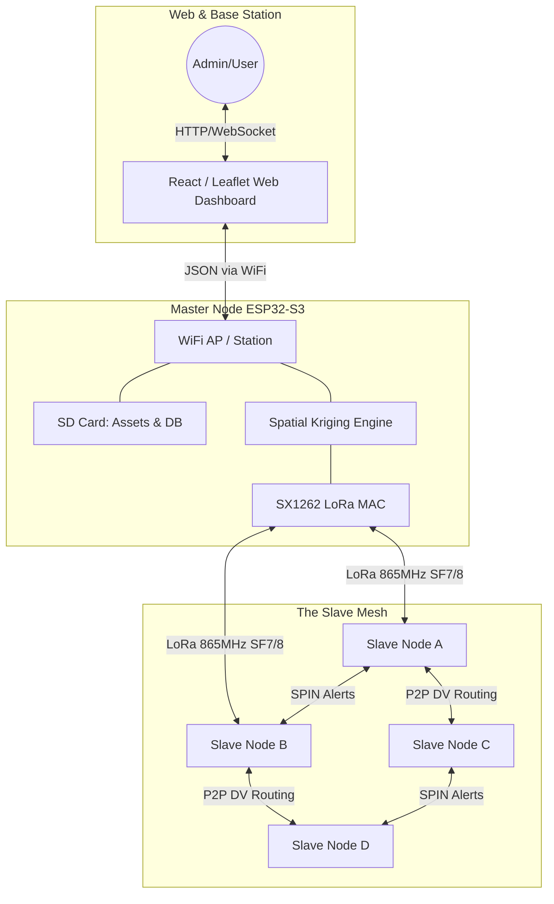
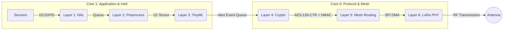
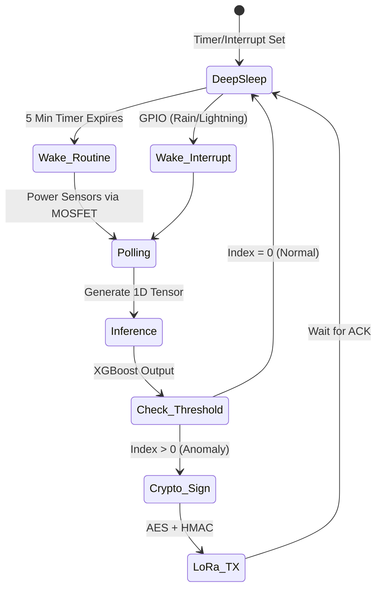

# Comprehensive Project Overview: Hybrid Mesh Micro-Climate WSN

## 1. Executive Summary
This project represents a state-of-the-art, **Hybrid Mesh Wireless Sensor Network (WSN)** designed for macro-regional micro-climate mapping and severe weather detection. By combining long-range RF communications (LoRa) with embedded machine learning (TinyML), the network shifts intelligence to the extreme edge. 

Instead of relying on a fragile centralized cellular gateway or flooding the airwaves with raw data, nodes operate autonomously on solar power, run local temporal inferencing, and communicate via a Peer-to-Peer Distance-Vector mesh. A designated **Master Node** overlays this mesh, providing a centralized Web Dashboard, Remote Procedure Call (RPC) command injection, and Spatial Kriging.

### Advantages vs. Conventional Systems
*   **Zero Ongoing Costs:** Traditional WSNs rely on 4G/LTE cellular SIM cards for every node, incurring massive monthly subscription fees. This system uses the free, public 865MHz ISM band.
*   **Infrastructure Immunity:** Standard networks die when cellular towers lose power during severe storms. Because this mesh routes Peer-to-Peer locally, it continues generating weather models even during catastrophic grid failures.
*   **Micro-Resolution:** Satellites and radar provide macro-weather data (kilometer resolution). This network provides micro-climate data (meter resolution), capable of detecting a localized factory chemical leak or a highly specific wind shear.
*   **Infinite Lifespan:** While standard LoRaWAN nodes rely on non-rechargeable coin cells and transmit dumb data, our 10W solar + AI-gated transmission ensures nodes never require battery replacement.

---

## 2. System Architecture & Topology

The network abandons the LoRaWAN Star topology in favor of a Hybrid Mesh. Slaves route packets for each other (P2P), but answer to the Master Node for global configuration.



---

## 3. Data Flow & Compute Pipeline (The 7 Layers)

To prevent the ESP32-S3 from suffering "event blockage," the architecture utilizes FreeRTOS dual-core task pinning.


**Layer 6 (LoRa PHY):** SX1262 module utilizing **Adaptive Data Rate (ADR)**. The network dynamically shifts between SF7 (prioritizing high bandwidth and short time-on-air for dense mesh areas) and SF10/SF11 (prioritizing ultra-long range for sparse, distant nodes).

---

## 4. Power Management State Machine

Every node operates on a strict 10W Solar + 10,000mAh battery budget. 



---

## 5. Security, Cryptography & Node Integration

*   **Cryptographic Suite:** `AES-128-CTR` (Stream Cipher - zero padding waste) + `HMAC-SHA256` (Authentication).
*   **Auto-Integration:** New nodes listen for `HELLO` beacons. They execute a **Nonce Synchronization** to sync their internal 32-bit counter with the mesh, fundamentally preventing replay attacks.
*   **Secure RPC:** The Master packages an instruction, encrypts it, and hashes it using the current rolling nonce. The Slave verifies the hash and nonce before executing the command.

---

## 6. Master-Slave RPC Instruction Set

```cpp
enum RpcCommand {
    CMD_FORCE_INFERENCE   = 0x01, // Wake up and run XGBoost model now
    CMD_SEND_TELEMETRY    = 0x02, // Send raw temp/hum/press/wind
    CMD_UPDATE_THRESH     = 0x03, // Change ML anomaly threshold globally
    CMD_SET_SLEEP_MS      = 0x04, // Change deep sleep RTOS duration
    CMD_DISABLE_PERIPH    = 0x05, // Cut MOSFET power to a broken sensor
    CMD_REBOOT            = 0x06  // Trigger hardware esp_restart()
};
```

---

## 7. Bill of Materials (BOM) & Pricing (INR)

*Note: Prices are estimated retail values in Indian Rupees (₹) for single-unit prototype quantities. Bulk manufacturing will significantly reduce costs. Sourcing links are representative examples.*

### A. Slave Node BOM (Edge Gatherer)
| Category | Component | Est. Price (INR) | Source / Link |
| :--- | :--- | :--- | :--- |
| **Compute & RF** | ESP32-S3 WROOM Module | ₹ 650 | [Robu.in](https://robu.in/product/esp32-s3-wroom-1-n8r8-wi-fi-bluetooth-module/) |
| | SX1262 SPI Transceiver (865-867 MHz) | ₹ 750 | [Robu.in](https://robu.in/product/ebyte-e22-900m22s-sx1262-915mhz-868mhz-smd-wireless-module/) |
| | 868MHz 3dBi/5dBi Omni Dipole Antenna | ₹ 200 | [Robu.in](https://robu.in/product/868mhz-5dbi-gsm-antenna-with-sma-male-connector/) |
| **Power System** | 10W Solar Panel + CN3791 MPPT IC | ₹ 1,200 | [Robu.in](https://robu.in/product/12v-10w-polycrystalline-solar-panel/) |
| | 10,000mAh 18650 Li-Ion Array (3 cells) | ₹ 900 | [Robu.in](https://robu.in/product/samsung-3300mah-3-7v-18650-li-ion-battery/) |
| | HT7333 LDO + IRLML2502 MOSFETs | ₹ 150 | [Robu.in](https://robu.in/product/ht7333-a-3-3v-low-power-ldo-voltage-regulator/) |
| **Sensors** | BME680 (Temp/Hum/Press/VOC) | ₹ 950 | [Robu.in](https://robu.in/product/bme680-digital-temperature-humidity-pressure-sensor/) |
| | AS3935 + MA5532 Antenna (Lightning) | ₹ 1,800 | [ElectronicsComp](https://www.electronicscomp.com) |
| | NEO-6M GPS (UART) | ₹ 450 | [Robu.in](https://robu.in/product/ublox-neo-6m-gps-module/) |
| | PIN Diode (BPW34) + LM358 OpAmp | ₹ 150 | [Robu.in](https://robu.in/product/bpw34-silicon-pin-photodiode/) |
| | Anemometer & Pluviometer (Bearings/Reed) | ₹ 600 | [Local Hardware](#) |
| **Physical Build** | IP67 ABS Enclosure + Gore-Tex Vents | ₹ 800 | [Robu.in](https://robu.in/product/waterproof-plastic-electronic-project-box-enclosure/) |
| | ASA/PETG Filament (UV/Temp Resistant) | ₹ 250 | [Robu.in](https://robu.in/product/flashforge-petg-1-75mm-3d-printer-filament-1kg-black/) |
| | M3/M2.5 SS Screws & Brass Inserts | ₹ 150 | [Local Hardware](#) |
| | Silicone Sealant & Desiccant Packets | ₹ 100 | [Local Hardware](#) |
| **Total** | **Estimated Slave Node Cost** | **₹ 9,100** | |

### B. Master Node BOM (Web Gateway + Full Sensor Array)
*The Master Node possesses the exact same micro-climate weather sensing capabilities as the Slave Nodes, but is upgraded with additional compute, high-gain RF, and storage.*

| Category | Component | Est. Price (INR) | Source / Link |
| :--- | :--- | :--- | :--- |
| **Compute & RF** | ESP32-S3 WROOM (**8MB PSRAM / 16MB Flash**) | ₹ 700 | [Robu.in](https://robu.in/product/esp32-s3-wroom-1-n16r8-module/) |
| | SX1262 SPI Transceiver (865-867 MHz) | ₹ 750 | [Robu.in](https://robu.in/product/ebyte-e22-900m22s-sx1262-915mhz-868mhz-smd-wireless-module/) |
| | 868MHz 8dBi/10dBi High-Gain Fiber Antenna | ₹ 800 | [Robu.in](https://robu.in/product/868mhz-8dbi-fiberglass-antenna/) |
| **Power System** | 10W Solar Panel + CN3791 MPPT IC | ₹ 1,200 | [Robu.in](https://robu.in/product/12v-10w-polycrystalline-solar-panel/) |
| | 10,000mAh 18650 Li-Ion Array (3 cells) | ₹ 900 | [Robu.in](https://robu.in/product/samsung-3300mah-3-7v-18650-li-ion-battery/) |
| | HT7333 LDO + IRLML2502 MOSFETs | ₹ 150 | [Robu.in](https://robu.in/product/ht7333-a-3-3v-low-power-ldo-voltage-regulator/) |
| **Sensors** | BME680 (Temp/Hum/Press/VOC) | ₹ 950 | [Robu.in](https://robu.in/product/bme680-digital-temperature-humidity-pressure-sensor/) |
| | AS3935 + MA5532 Antenna (Lightning) | ₹ 1,800 | [ElectronicsComp](https://www.electronicscomp.com) |
| | NEO-6M GPS (UART) | ₹ 450 | [Robu.in](https://robu.in/product/ublox-neo-6m-gps-module/) |
| | PIN Diode (BPW34) + LM358 OpAmp | ₹ 150 | [Robu.in](https://robu.in/product/bpw34-silicon-pin-photodiode/) |
| | Anemometer & Pluviometer (Bearings/Reed) | ₹ 600 | [Local Hardware](#) |
| **Storage/Timing** | MicroSD Card Module (SDIO) + 32GB SD | ₹ 500 | [Robu.in](https://robu.in/product/micro-sd-tf-card-memory-shield-module-spi/) |
| | DS3231 Precision RTC (I2C) + CR2032 | ₹ 150 | [Robu.in](https://robu.in/product/ds3231-rtc-module/) |
| **Physical Build** | IP67 ABS/Metal Enclosure + Vents | ₹ 800 | [Robu.in](https://robu.in/product/waterproof-plastic-electronic-project-box-enclosure/) |
| | ASA/PETG Filament (UV/Temp Resistant) | ₹ 250 | [Robu.in](https://robu.in/product/flashforge-petg-1-75mm-3d-printer-filament-1kg-black/) |
| | M3/M2.5 SS Screws & Brass Inserts | ₹ 150 | [Local Hardware](#) |
| | Silicone Sealant & Desiccant Packets | ₹ 100 | [Local Hardware](#) |
| **Total** | **Estimated Master Node Cost** | **₹ 10,400** | |

---

## 8. Bandwidth Limitations & Physics Validation

### A. LoRa Bandwidth (India 865-867 MHz)
While Indian regulations for 865-867 MHz do **not** legally enforce a hard duty cycle percentage limit (unlike Europe's 1% rule), physical packet collisions (the Aloha problem) will destroy the network if left unchecked.
*   **The Solution:** We enforce a strict self-imposed duty cycle via **Exception-Based Broadcasting**. By using AES-CTR and C++ struct bit-packing, payloads are kept to exactly ~6-10 bytes. The nodes remain silent 99.9% of the time, transmitting only when the TinyML Anomaly Index > 0.

### B. Power Autonomy Validation
The "indefinite autonomy" claim is mathematically verified:
*   **Deep Sleep Draw:** ESP32-S3 (~8µA) + Sensors (~2µA) = **10µA**.
*   **Active Draw:** 100mA for 1 second every 5 minutes = **0.33mA average continuous draw**.
*   **Total Autonomy:** Even if the sun never shines again, a 10,000mAh battery draining at 0.33mA will last roughly **30,000 hours (3.4 years)**. The 10W solar panel ensures the battery stays at 100%.

---

## 9. Global Web Interface
Hosted directly off the Master Node's SD Card.
*   **Mapbox/Leaflet Integration:** Renders a real-time World Map displaying Slave Node locations.
*   **Spatial Heatmaps:** Visualizes interpolated temperatures and VOC concentrations calculated by the Master.
*   **Command Injection:** Allows the administrator to click on a Slave Node marker and inject an RPC command (e.g., `CMD_DISABLE_PERIPH`).
