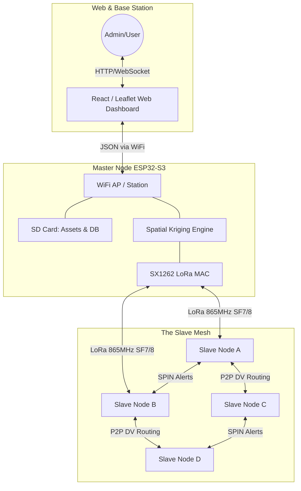
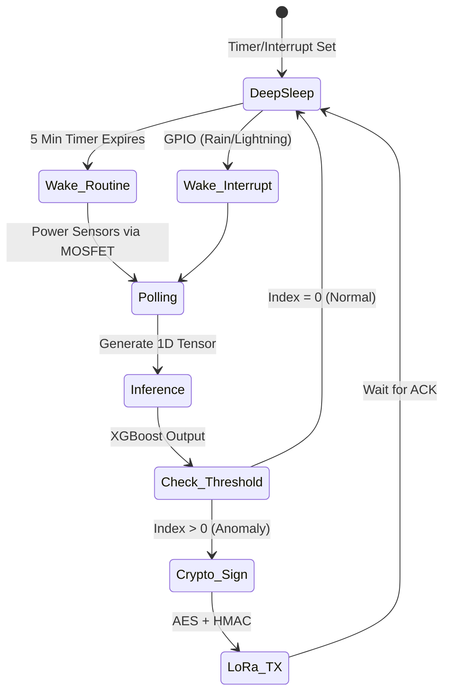

# Comprehensive Project Overview: Hybrid Mesh Micro-Climate WSN

## 1. Executive Summary
This project represents a state-of-the-art, **Hybrid Mesh Wireless Sensor Network (WSN)** designed for macro-regional micro-climate mapping and severe weather detection. By combining long-range RF communications (LoRa) with embedded machine learning (TinyML), the network shifts intelligence to the extreme edge. 

Instead of relying on a fragile centralized cellular gateway or flooding the airwaves with raw data, nodes operate autonomously on solar power, run local temporal inferencing, and communicate via a Peer-to-Peer Distance-Vector mesh. A designated **Master Node** overlays this mesh, providing a centralized Web Dashboard, Remote Procedure Call (RPC) command injection, and Spatial Kriging.

### Advantages vs. Conventional Systems
*   **Zero Ongoing Costs:** Traditional WSNs rely on 4G/LTE cellular SIM cards for every node, incurring massive monthly subscription fees. This system uses the free, public 865MHz ISM band.
*   **Infrastructure Immunity:** Standard networks die when cellular towers lose power during severe storms. Because this mesh routes Peer-to-Peer locally, it continues generating weather models even during catastrophic grid failures.
*   **Micro-Resolution:** Satellites and radar provide macro-weather data (kilometer resolution). This network provides micro-climate data (meter resolution), capable of detecting a localized factory chemical leak or a highly specific wind shear.
*   **Infinite Lifespan:** While standard LoRaWAN nodes rely on non-rechargeable coin cells and transmit dumb data, our 10W solar + AI-gated transmission ensures nodes never require battery replacement.

---

## 2. System Architecture & Topology

The network abandons the LoRaWAN Star topology in favor of a Hybrid Mesh. Slaves route packets for each other (P2P), but answer to the Master Node for global configuration.



### Architectural Flow Explanation:
1.  **The Sub-Networks:** The graph divides the architecture into three distinct zones: the User Web Interface, the Master Node, and the Slave Mesh.
2.  **Slave Mesh (P2P Layer):** Slave Nodes A, B, C, and D communicate bidirectionally with each other using LoRa RF on the 865-867MHz band. Because they use a Distance-Vector (DV) routing protocol, Slave D can route a packet through Slave B to reach the Master, eliminating the need for a central star-topology tower. They also exchange SPIN alerts (Advertisements/Requests) amongst themselves to warn of incoming weather anomalies before the Master even knows.
3.  **Master Node (The Bridge):** The Master Node acts as a dual-interface gateway. On one side, it possesses the exact same LoRa MAC (SX1262) as the slaves, allowing it to inject RPC commands into the mesh and poll nodes for telemetry. It then feeds this telemetry into its onboard Spatial Kriging Engine to interpolate weather data for areas *between* the physical nodes.
4.  **Web Interface (The Exit Node):** The Master Node takes the interpolated data and hosts it on its local SD card via a native WiFi Access Point. An Administrator connects their laptop to this WiFi, opens a browser, and views a React/Leaflet dashboard. The Admin can click a button on the UI, which travels backward down the chain: WiFi -> Master ESP32 -> LoRa RF -> specific Slave Node to execute an RPC command.

---

## 3. Strict Software Modularization (The 7 Layers)

To guarantee system stability, the firmware operates on a **Strictly Decoupled Modular Architecture**. Layers never call each other's functions directly. They act as independent state machines communicating exclusively via thread-safe **FreeRTOS Queues**. This means Layer 2 has absolutely no I2C code, and Layer 5 has no knowledge of how TinyML works.

```mermaid
classDiagram
    class Layer0_Power {
        <<Global HW State>>
        +Wake CPU
        +Trigger Brownout
    }
    class Layer1_HAL {
        <<Input: I2C/GPIO Signals>>
        +Poll_BME680()
        +Count_Interrupts()
        <<Output: SensorDataStruct Queue>>
    }
    class Layer2_Preprocess {
        <<Input: SensorDataStruct Queue>>
        +Apply_Standard_Scaling()
        +Calculate_Deltas()
        <<Output: 1D Tensor Queue>>
    }
    class Layer3_TinyML {
        <<Input: 1D Tensor Queue>>
        +Run_XGBoost_Tree()
        <<Output: AlertEvent Queue>>
    }
    class Layer4_Crypto {
        <<Input: AlertEvent Queue>>
        +AES_CTR_Encrypt()
        +HMAC_SHA256_Sign()
        <<Output: Ciphertext Queue>>
    }
    class Layer5_Routing {
        <<Input: Ciphertext Queue>>
        +Check_Distance_Vector()
        +Format_SPIN_Header()
        <<Output: LoRa TX Buffer Queue>>
    }
    class Layer6_LoRaPHY {
        <<Input: LoRa TX Buffer Queue>>
        +Trigger_SPI_DMA()
    }
    
    Layer0_Power --> Layer1_HAL : HW Wake Trigger
    Layer1_HAL --> Layer2_Preprocess : push(Queue 1)
    Layer2_Preprocess --> Layer3_TinyML : push(Queue 2)
    Layer3_TinyML --> Layer4_Crypto : push(Queue 3)
    Layer4_Crypto --> Layer5_Routing : push(Queue 4)
    Layer5_Routing --> Layer6_LoRaPHY : push(Queue 5)
```



### Data Flow & Execution Explanation:
This class diagram illustrates the "Zero-Coupling" philosophy. Data only moves in one direction (Top to Bottom) via FreeRTOS Queues. 
1.  **Awakening (Layer 0):** The hardware RTOS timer or a physical GPIO pin interrupt (like a lightning strike on the AS3935) triggers Layer 0, waking the ESP32 CPU from Deep Sleep.
2.  **Gathering (Layer 1):** The Hardware Abstraction Layer executes I2C, UART, and ADC reads across the 11-sensor array. It bundles this raw data into a `SensorDataStruct` and pushes it into FreeRTOS Queue 1.
3.  **Math & AI (Layer 2 & 3):** Layer 2 pulls the struct, strips away the hardware context, applies mathematical Min-Max scaling, and pushes a pure 1D Tensor array of floats to Queue 2. Layer 3 (TinyML) ingests this tensor, runs it through an XGBoost decision tree, and outputs a simple 8-bit Anomaly Index (e.g., 0=Normal, 2=Severe Storm) to Queue 3.
4.  **Security & Routing (Layer 4 & 5):** Layer 4 pulls the Anomaly Index, encrypts it using AES-128-CTR with the current rolling nonce, and signs it with HMAC-SHA256. It pushes the resulting ciphertext to Queue 4. Layer 5 retrieves the ciphertext, slaps on a P2P SPIN routing header (target MAC, hop count), and pushes it to Queue 5.
5.  **Transmission (Layer 6):** Finally, Layer 6 triggers the hardware SPI Direct Memory Access (DMA), blasting the byte array out of the SX1262 LoRa antenna using Adaptive Data Rate. 

### The Modular Rules of Engagement
*   **Layer 1 (HAL):** *Rule:* Completely blind to the network. It solely reads registers and dumps raw `SensorDataStructs` into Queue 1.
*   **Layer 2 (Preprocessing):** *Rule:* Hardware-agnostic. It pops from Queue 1, normalizes the data, and pushes a pure math `float array` (1D Tensor) to Queue 2.
*   **Layer 3 (TinyML Engine):** *Rule:* Only does math. Pops from Queue 2, runs the decision tree, and pushes an 8-bit anomaly index to Queue 3.
*   **Layer 4 (Cryptography):** *Rule:* Black-box encryption. Pops the index, encrypts it with the rolling nonce, and pushes the ciphertext to Queue 4.
*   **Layer 5 (Mesh Routing):** *Rule:* Has no idea what the payload means. It wraps the ciphertext in a Distance-Vector header and pushes to Queue 5.
*   **Layer 6 (LoRa PHY):** *Rule:* Simply shifts bytes from Queue 5 out over the SPI bus via DMA using Adaptive Data Rate (ADR).

---

## 4. Power Management State Machine

Every node operates on a strict 10W Solar + 10,000mAh battery budget. 



### Power State Flow Explanation:
This state machine proves how the nodes survive indefinitely on a tiny 10W solar budget by remaining silent unless absolutely necessary.
1.  **Default State (Deep Sleep):** The ESP32's dual cores are entirely powered off. The Ultra-Low Power (ULP) coprocessor manages timers. Power-hungry sensors (like the PMS5003 PM2.5 fan) are physically disconnected from the battery by N-Channel MOSFETs. Total current draw is <10µA.
2.  **Wake Triggers:** There are two ways to exit Deep Sleep. The first is a routine internal RTC timer (e.g., every 5 minutes). The second is an asynchronous hardware interrupt from a sensor that stays on at nano-amp levels (e.g., the rain gauge tips, or the AS3935 detects a lightning EMP).
3.  **Active Compute (Polling & Inference):** Once awake, the ESP32 switches on the MOSFETs, powers the sensors, reads the bus, and generates the 1D Tensor. It runs the TinyML inference locally. This entire process takes roughly ~500 milliseconds.
4.  **The AI Gate (Check_Threshold):** This is the critical bandwidth and power saving step. If the XGBoost model outputs an Index of 0 (Normal Weather), the node *aborts transmission* and instantly goes back to Deep Sleep. 
5.  **Exception Transmission:** Only if the Index > 0 (Anomaly Detected) will the node proceed to Cryptography and LoRa TX. It encrypts the payload, transmits it, waits briefly for a P2P ACK from a neighbor, and immediately sleeps. By gating the LoRa radio behind the AI threshold, we save 99% of our battery capacity.

---

## 5. Security, Cryptography & Node Integration

*   **Cryptographic Suite:** `AES-128-CTR` (Stream Cipher - zero padding waste) + `HMAC-SHA256` (Authentication).
*   **Auto-Integration:** New nodes listen for `HELLO` beacons. They execute a **Nonce Synchronization** to sync their internal 32-bit counter with the mesh, fundamentally preventing replay attacks.
*   **Secure RPC:** The Master packages an instruction, encrypts it, and hashes it using the current rolling nonce. The Slave verifies the hash and nonce before executing the command.

---

## 6. Master-Slave RPC Instruction Set

```cpp
enum RpcCommand {
    CMD_FORCE_INFERENCE   = 0x01, // Wake up and run XGBoost model now
    CMD_SEND_TELEMETRY    = 0x02, // Send raw temp/hum/press/wind
    CMD_UPDATE_THRESH     = 0x03, // Change ML anomaly threshold globally
    CMD_SET_SLEEP_MS      = 0x04, // Change deep sleep RTOS duration
    CMD_DISABLE_PERIPH    = 0x05, // Cut MOSFET power to a broken sensor
    CMD_REBOOT            = 0x06  // Trigger hardware esp_restart()
};
```

---

## 7. Engineering Design Standards

To ensure macro-regional survivability (high vibration, extreme heat, monsoon humidity), all nodes must adhere to the following physical hardware standards:

### A. Cabling & Wire Gauge
*   **Power Subsystem (Solar/Battery to MPPT/ESP32):** Use **22 AWG Silicone Stranded Wire**. Silicone insulation resists melting outdoors and remains highly flexible.
*   **Signal & Sensor Lines (I2C, SPI, UART, GPIO):** Use **26 AWG Silicone Stranded Wire** to reduce bulk and capacitance.

### B. Connectors
*   **Board-to-Wire (Sensors):** Direct soldering is forbidden. All sensors must connect to the main PCB using **JST-XH (2.54mm pitch) latched connectors** to prevent disconnects due to wind vibration.
*   **High-Current Power (Battery):** Use **XT60 connectors** between the 18650 battery array and the PCB for reliable, high-amp connections that can be easily unplugged for maintenance.
*   **RF/Antenna:** The SX1262 connects to the external antenna using a shielded **IPEX/U.FL to SMA-Female Bulkhead** pigtail. The SMA connector mounts through the enclosure wall, sealed with an O-ring.

### C. Fasteners & Mechanical
*   **Screws:** All PCBs and 3D printed parts must be mounted using **M2.5 and M3 Stainless Steel (SS304/SS316) Socket Cap Screws**. Zinc-plated screws will rust and fail.
*   **Threaded Inserts:** Screwing directly into 3D-printed plastic is forbidden. Use **M3 Brass Heat-Set Threaded Inserts** melted into the PETG/ASA mounts.
*   **PCB Standoffs:** Use Nylon hex standoffs to prevent electrical shorts.

---

## 8. Sensor Array Specifications

Each node (both Master and Slave) contains the exact same micro-climate sensor array.

*   **BME680 (Protocol: I2C):** A micro-heated MEMS sensor. It provides Temperature, Humidity, Barometric Pressure, and Volatile Organic Compounds (VOC) for Air Quality Indexing. Using I2C allows it to share pins with other sensors.
*   **AS3935 (Protocol: I2C/SPI):** A specialized lightning sensor IC connected to a custom MA5532 antenna coil. It detects cloud-to-ground and cloud-to-cloud strikes up to 40km away, reporting distance and energy. We use I2C to share the bus with the BME680.
*   **NEO-6M GPS (Protocol: UART):** Provides absolute geo-coordinates and highly precise UTC time. Communicates over standard RX/TX pins. It is heavily power-gated (switched off via MOSFET) after initial mesh registration.
*   **Anemometer (Protocol: GPIO / PCNT):** Measures wind speed. Uses 3D-printed wind cups spinning a magnet over a Hall-Effect sensor or Rotary Encoder. This sends high-speed digital pulses to the ESP32's Pulse Counter (PCNT) hardware peripheral.
*   **Pluviometer (Protocol: GPIO Interrupt):** Measures rain. A 3D-printed tipping bucket triggers a magnetic reed switch. The ESP32 reads this as a hardware interrupt (falling edge).
*   **PIN Diode - BPW34 (Protocol: Analog / ADC):** Detects Beta/Gamma radiation. The tiny current from a particle strike is amplified by an LM358 Op-Amp into a voltage spike, which the ESP32 reads via an Analog-to-Digital (ADC) pin.
*   **INMP441 (Protocol: I2S):** MEMS digital microphone for Acoustic AI. The TinyML engine listens to the audio spectrum to classify thunder, rain intensity, or chainsaws (illegal logging).
*   **PMS5003 (Protocol: UART):** Laser-scattering Particulate Matter sensor. Accurately maps PM2.5/PM10 for wildfire smoke and smog. Heavily power-gated via MOSFET due to its internal fan.
*   **AS5600 (Protocol: I2C):** Contactless magnetic rotary encoder attached to a wind vane. Provides Absolute Wind Direction without physical friction.
*   **VEML7700 (Protocol: I2C):** High-precision Ambient Light and UV Index sensor to measure solar irradiance and cloud density.
*   **SHT20 (Protocol: I2C via RS485):** Waterproof soil moisture and temperature probe for agricultural/drought mapping.

---

## 9. Bill of Materials (BOM) & Pricing (INR)

*Note: Prices are estimated retail values in Indian Rupees (₹) for single-unit prototype quantities. Bulk manufacturing will significantly reduce costs. Sourcing links are representative examples.*

### A. Slave Node BOM (Edge Gatherer)
| Category | Component | Est. Price (INR) | Source / Link |
| :--- | :--- | :--- | :--- |
| **Compute & RF** | ESP32-S3 WROOM Module | ₹ 650 | [Robu.in](https://robu.in/product/esp32-s3-wroom-1-n8r8-wi-fi-bluetooth-module/) |
| | SX1262 SPI Transceiver (865-867 MHz) | ₹ 750 | [Robu.in](https://robu.in/product/ebyte-e22-900m22s-sx1262-915mhz-868mhz-smd-wireless-module/) |
| | 868MHz 3dBi/5dBi Omni Dipole Antenna | ₹ 200 | [Robu.in](https://robu.in/product/868mhz-5dbi-gsm-antenna-with-sma-male-connector/) |
| **Power System** | 10W Solar Panel + CN3791 MPPT IC | ₹ 1,200 | [Robu.in](https://robu.in/product/12v-10w-polycrystalline-solar-panel/) |
| | 10,000mAh 18650 Li-Ion Array (3 cells) | ₹ 900 | [Robu.in](https://robu.in/product/samsung-3300mah-3-7v-18650-li-ion-battery/) |
| | HT7333 LDO + IRLML2502 MOSFETs | ₹ 150 | [Robu.in](https://robu.in/product/ht7333-a-3-3v-low-power-ldo-voltage-regulator/) |
| **Sensors** | BME680 (Temp/Hum/Press/VOC) | ₹ 950 | [Robu.in](https://robu.in/product/bme680-digital-temperature-humidity-pressure-sensor/) |
| | AS3935 + MA5532 Antenna (Lightning) | ₹ 1,800 | [ElectronicsComp](https://www.electronicscomp.com) |
| | NEO-6M GPS (UART) | ₹ 450 | [Robu.in](https://robu.in/product/ublox-neo-6m-gps-module/) |
| | PIN Diode (BPW34) + LM358 OpAmp | ₹ 150 | [Robu.in](https://robu.in/product/bpw34-silicon-pin-photodiode/) |
| | Anemometer & Pluviometer (Bearings/Reed) | ₹ 600 | [Local Hardware](#) |
| | INMP441 MEMS Microphone (I2S) | ₹ 200 | [Robu.in](https://robu.in/product/inmp441-omnidirectional-microphone-module/) |
| | PMS5003 PM2.5/PM10 Sensor (UART) | ₹ 1,200 | [Robu.in](https://robu.in/product/pms5003-digital-universal-particle-concentration-sensor/) |
| | AS5600 Magnetic Encoder (Wind Direction) | ₹ 250 | [Robu.in](https://robu.in/product/as5600-magnetic-encoder-module/) |
| | VEML7700 Ambient Light Sensor (I2C) | ₹ 250 | [Robu.in](https://robu.in/product/veml7700-ambient-light-sensor-module/) |
| | SHT20 Waterproof Soil Probe | ₹ 400 | [Robu.in](https://robu.in/product/sht20-temperature-humidity-sensor-probe/) |
| **Physical Build** | IP67 ABS Enclosure + Gore-Tex Vents | ₹ 800 | [Robu.in](https://robu.in/product/waterproof-plastic-electronic-project-box-enclosure/) |
| | ASA/PETG Filament (UV/Temp Resistant) | ₹ 250 | [Robu.in](https://robu.in/product/flashforge-petg-1-75mm-3d-printer-filament-1kg-black/) |
| | M3/M2.5 SS Screws & Brass Inserts | ₹ 150 | [Local Hardware](#) |
| | 22/26 AWG Silicone Wire + JST-XH/XT60 Connectors | ₹ 300 | [Robu.in](https://robu.in/product/jst-xh-2-54mm-pitch-connector-kit/) |
| | IPEX/U.FL to SMA Bulkhead Pigtail | ₹ 150 | [Robu.in](https://robu.in/product/ipex-to-sma-female-bulkhead-cable/) |
| | Silicone Sealant & Desiccant Packets | ₹ 100 | [Local Hardware](#) |
| **Total** | **Estimated Slave Node Cost** | **₹ 11,850** | |

### B. Master Node BOM (Web Gateway + Full Sensor Array)
*The Master Node possesses the exact same micro-climate weather sensing capabilities as the Slave Nodes, but is upgraded with additional compute, high-gain RF, and storage.*

| Category | Component | Est. Price (INR) | Source / Link |
| :--- | :--- | :--- | :--- |
| **Compute & RF** | ESP32-S3 WROOM (**8MB PSRAM / 16MB Flash**) | ₹ 700 | [Robu.in](https://robu.in/product/esp32-s3-wroom-1-n16r8-module/) |
| | SX1262 SPI Transceiver (865-867 MHz) | ₹ 750 | [Robu.in](https://robu.in/product/ebyte-e22-900m22s-sx1262-915mhz-868mhz-smd-wireless-module/) |
| | 868MHz 8dBi/10dBi High-Gain Fiber Antenna | ₹ 800 | [Robu.in](https://robu.in/product/868mhz-8dbi-fiberglass-antenna/) |
| **Power System** | 10W Solar Panel + CN3791 MPPT IC | ₹ 1,200 | [Robu.in](https://robu.in/product/12v-10w-polycrystalline-solar-panel/) |
| | 10,000mAh 18650 Li-Ion Array (3 cells) | ₹ 900 | [Robu.in](https://robu.in/product/samsung-3300mah-3-7v-18650-li-ion-battery/) |
| | HT7333 LDO + IRLML2502 MOSFETs | ₹ 150 | [Robu.in](https://robu.in/product/ht7333-a-3-3v-low-power-ldo-voltage-regulator/) |
| **Sensors** | BME680 (Temp/Hum/Press/VOC) | ₹ 950 | [Robu.in](https://robu.in/product/bme680-digital-temperature-humidity-pressure-sensor/) |
| | AS3935 + MA5532 Antenna (Lightning) | ₹ 1,800 | [ElectronicsComp](https://www.electronicscomp.com) |
| | NEO-6M GPS (UART) | ₹ 450 | [Robu.in](https://robu.in/product/ublox-neo-6m-gps-module/) |
| | PIN Diode (BPW34) + LM358 OpAmp | ₹ 150 | [Robu.in](https://robu.in/product/bpw34-silicon-pin-photodiode/) |
| | Anemometer & Pluviometer (Bearings/Reed) | ₹ 600 | [Local Hardware](#) |
| | INMP441 MEMS Microphone (I2S) | ₹ 200 | [Robu.in](https://robu.in/product/inmp441-omnidirectional-microphone-module/) |
| | PMS5003 PM2.5/PM10 Sensor (UART) | ₹ 1,200 | [Robu.in](https://robu.in/product/pms5003-digital-universal-particle-concentration-sensor/) |
| | AS5600 Magnetic Encoder (Wind Direction) | ₹ 250 | [Robu.in](https://robu.in/product/as5600-magnetic-encoder-module/) |
| | VEML7700 Ambient Light Sensor (I2C) | ₹ 250 | [Robu.in](https://robu.in/product/veml7700-ambient-light-sensor-module/) |
| | SHT20 Waterproof Soil Probe | ₹ 400 | [Robu.in](https://robu.in/product/sht20-temperature-humidity-sensor-probe/) |
| **Storage/Timing** | MicroSD Card Module (SDIO) + 32GB SD | ₹ 500 | [Robu.in](https://robu.in/product/micro-sd-tf-card-memory-shield-module-spi/) |
| | DS3231 Precision RTC (I2C) + CR2032 | ₹ 150 | [Robu.in](https://robu.in/product/ds3231-rtc-module/) |
| **Physical Build** | IP67 ABS/Metal Enclosure + Vents | ₹ 800 | [Robu.in](https://robu.in/product/waterproof-plastic-electronic-project-box-enclosure/) |
| | ASA/PETG Filament (UV/Temp Resistant) | ₹ 250 | [Robu.in](https://robu.in/product/flashforge-petg-1-75mm-3d-printer-filament-1kg-black/) |
| | M3/M2.5 SS Screws & Brass Inserts | ₹ 150 | [Local Hardware](#) |
| | 22/26 AWG Silicone Wire + JST-XH/XT60 Connectors | ₹ 300 | [Robu.in](https://robu.in/product/jst-xh-2-54mm-pitch-connector-kit/) |
| | IPEX/U.FL to SMA Bulkhead Pigtail | ₹ 150 | [Robu.in](https://robu.in/product/ipex-to-sma-female-bulkhead-cable/) |
| | Silicone Sealant & Desiccant Packets | ₹ 100 | [Local Hardware](#) |
| **Total** | **Estimated Master Node Cost** | **₹ 13,150** | |

---

## 10. Bandwidth Limitations & Physics Validation

### A. LoRa Bandwidth (India 865-867 MHz)
While Indian regulations for 865-867 MHz do **not** legally enforce a hard duty cycle percentage limit (unlike Europe's 1% rule), physical packet collisions (the Aloha problem) will destroy the network if left unchecked.
*   **The Solution:** We enforce a strict self-imposed duty cycle via **Exception-Based Broadcasting**. By using AES-CTR and C++ struct bit-packing, payloads are kept to exactly ~6-10 bytes. The nodes remain silent 99.9% of the time, transmitting only when the TinyML Anomaly Index > 0.

### B. Power Autonomy Validation
The "indefinite autonomy" claim is mathematically verified:
*   **Deep Sleep Draw:** ESP32-S3 (~8µA) + Sensors (~2µA) = **10µA**.
*   **Active Draw:** 100mA for 1 second every 5 minutes = **0.33mA average continuous draw**.
*   **Total Autonomy:** Even if the sun never shines again, a 10,000mAh battery draining at 0.33mA will last roughly **30,000 hours (3.4 years)**. The 10W solar panel ensures the battery stays at 100%.

---

## 11. Global Web Interface
Hosted directly off the Master Node's SD Card.
*   **Mapbox/Leaflet Integration:** Renders a real-time World Map displaying Slave Node locations.
*   **Spatial Heatmaps:** Visualizes interpolated temperatures and VOC concentrations calculated by the Master.
*   **Command Injection:** Allows the administrator to click on a Slave Node marker and inject an RPC command (e.g., `CMD_DISABLE_PERIPH`).
