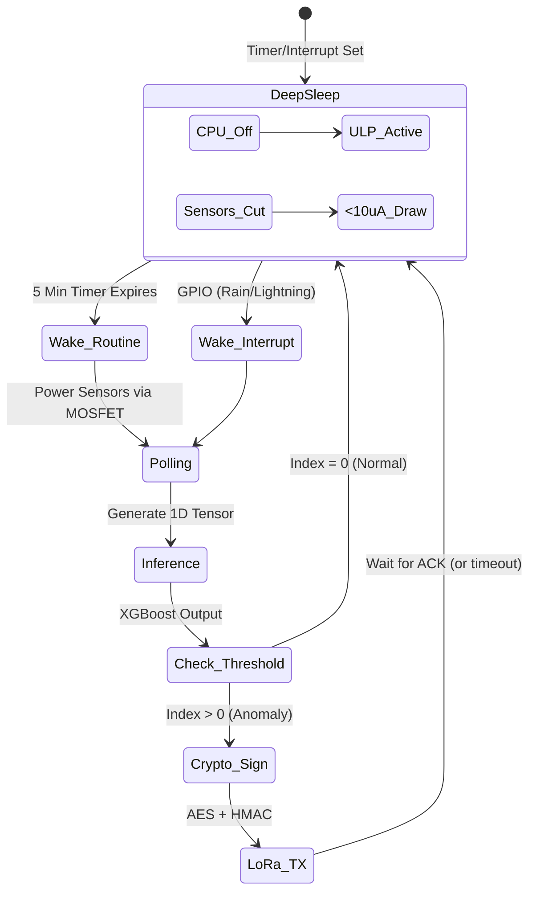

# Comprehensive Project Overview: Hybrid Mesh Micro-Climate WSN

## 1. Executive Summary
This project represents a state-of-the-art, **Hybrid Mesh Wireless Sensor Network (WSN)** designed for macro-regional micro-climate mapping and severe weather detection. By combining long-range RF communications (LoRa) with embedded machine learning (TinyML), the network shifts intelligence to the extreme edge. 

Instead of relying on a fragile centralized cellular gateway or flooding the airwaves with raw data, nodes operate autonomously on solar power, run local temporal inferencing, and communicate via a Peer-to-Peer Distance-Vector mesh. A designated **Master Node** overlays this mesh, providing a centralized Web Dashboard, Remote Procedure Call (RPC) command injection, and Spatial Kriging, while strictly adhering to the same micro-power hardware constraints as the field slaves.

---

## 2. System Architecture & Topology

The network abandons the LoRaWAN Star topology in favor of a Hybrid Mesh. Slaves route packets for each other (P2P), but answer to the Master Node for global configuration and asynchronous data polling.

```mermaid
graph TD
    subgraph Web & Base Station
        Admin((Admin/User))
        WebUI[React / Leaflet Web Dashboard]
    end

    subgraph Master Node (ESP32-S3)
        WiFi[WiFi AP / Station]
        SD[SD Card: Assets & DB]
        LoRaM[SX1262 LoRa MAC]
        Spatial[Spatial Kriging Engine]
    end

    subgraph The Slave Mesh (ESP32-S3 Nodes)
        S1[Slave Node A]
        S2[Slave Node B]
        S3[Slave Node C]
        S4[Slave Node D]
    end

    Admin <-->|HTTP/WebSocket| WebUI
    WebUI <-->|JSON via WiFi| WiFi
    WiFi --- SD
    WiFi --- Spatial
    Spatial --- LoRaM
    
    LoRaM <-->|LoRa 865MHz SF7/8| S1
    LoRaM <-->|LoRa 865MHz SF7/8| S2
    
    S1 <-->|P2P DV Routing| S3
    S1 <-->|SPIN Alerts| S2
    S2 <-->|P2P DV Routing| S4
    S3 <-->|SPIN Alerts| S4
```

---

## 3. Data Flow & Compute Pipeline (The 7 Layers)

To prevent the ESP32-S3 from suffering "event blockage," the architecture utilizes FreeRTOS dual-core task pinning. Core 1 handles intelligence; Core 0 handles the radio and cryptography.

```mermaid
flowchart LR
    subgraph Core 1 (Application & Intel)
        S[Sensors] -->|I2C/GPIO| L1(Layer 1: HAL)
        L1 -->|Queue| L2(Layer 2: Preprocess)
        L2 -->|1D Tensor| L3(Layer 3: TinyML)
    end

    subgraph Core 0 (Protocol & Mesh)
        L3 -->|Alert Event Queue| L4(Layer 4: Crypto)
        L4 -->|AES-128-CTR + HMAC| L5(Layer 5: Mesh Routing)
        L5 -->|SPI DMA| L6(Layer 6: LoRa PHY)
    end
    
    L6 -->|RF Transmission| Radio((Antenna))
```
*   **Layer 1 (HAL):** Raw sensor polling (BME680, AS3935).
*   **Layer 2 (Preprocessing):** Applies standard scaling and calculates rolling window deltas.
*   **Layer 3 (TinyML Engine):** Quantized XGBoost/CatBoost decision trees output an Anomaly Index.
*   **Layer 4 (Cryptography):** Hardware-accelerated AES-128-CTR encryption + HMAC-SHA256.
*   **Layer 5 (Mesh Routing):** Distance-Vector table maintenance and SPIN alert negotiation.
*   **Layer 6 (LoRa PHY):** SX1262 tuned to SF7/SF8 on the 865-867MHz ISM band.

---

## 4. Power Management State Machine

Every node operates on a strict 10W Solar + 10,000mAh battery budget. 



---

## 5. Security, Cryptography & Node Integration

Because the network operates on a public ISM band, all traffic is heavily secured using the ESP32-S3's hardware cryptographic accelerators.

### A. Cryptographic Suite
*   **Encryption:** `AES-128-CTR` (Stream Cipher). Used because it requires no padding. A tightly packed 6-byte LoRa payload remains exactly 6 bytes, preserving precious airtime.
*   **Authentication:** `HMAC-SHA256`. Attached to the end of every packet. A receiving node hashes the payload using the Pre-Shared Network Key. If the hash matches the HMAC tag, the sender is verified and spoofing is impossible.

### B. Auto-Discovery & Integration of New Nodes
When a brand new Slave Node is powered on in the field, it autonomously joins the mesh:
1.  **Passive RX:** The node listens for `HELLO` beacons broadcasted periodically by existing nodes.
2.  **HELLO Broadcast:** The node broadcasts its own `HELLO` packet containing its MAC address and hop metric.
3.  **Nonce Synchronization (Anti-Replay):** To prevent replay attacks, the new node requests the current 32-bit rolling network counter from its neighbor. The neighbor authenticates the request and passes the counter. 
4.  **Integration:** The node updates its routing table and is now an active router and data gatherer.

### C. Secure Master-Slave RPC Commands
When the Master Node wants to send a command to a Slave:
1. The Master packages the instruction (e.g., `CMD_SET_SLEEP_MS`).
2. The Master encrypts it with AES-128-CTR and hashes it with HMAC-SHA256, utilizing the current rolling nonce.
3. The LoRa mesh routes it to the specific Slave.
4. The Slave decrypts the payload, verifies the HMAC, verifies the nonce is higher than the last seen packet (proving it's not a replay attack), and executes the command on Core 0.

---

## 6. Master-Slave RPC Instruction Set

```cpp
enum RpcCommand {
    CMD_FORCE_INFERENCE   = 0x01, // Wake up and run XGBoost model now
    CMD_SEND_TELEMETRY    = 0x02, // Send raw temp/hum/press/wind (Polled by Master)
    CMD_UPDATE_THRESH     = 0x03, // Change ML anomaly threshold globally
    CMD_SET_SLEEP_MS      = 0x04, // Change deep sleep RTOS duration
    CMD_DISABLE_PERIPH    = 0x05, // Cut MOSFET power to a broken/spamming sensor
    CMD_REBOOT            = 0x06  // Trigger hardware esp_restart()
};
```
### Efficient Polling (Staggered Token)
To prevent LoRa packet collisions, the Master uses a **Staggered Polling Queue**. It requests data from Slave A, waits for the ACK, then polls Slave B. Missing data is handled by the Master's **Spatial Kriging Engine**.

---

## 7. Comprehensive Bill of Materials (BOM)

### A. Slave Node BOM (Edge Gatherer)
**Compute & RF:**
*   **Microcontroller:** ESP32-S3 WROOM Module.
*   **LoRa Transceiver:** SX1262 SPI Transceiver (865-867MHz) + 3dBi/5dBi Omni Antenna.
**Power Subsystem:**
*   **Solar Panel:** 10W Monocrystalline.
*   **Battery:** 10,000mAh Lithium-Ion 18650 Battery Array.
*   **Regulation:** MPPT IC (CN3791), Ultra-low Iq LDO (HT7333), Logic-Level MOSFETs (IRLML2502) for peripheral switching.
**Sensor Array:**
*   **BME680 (I2C):** Temp, Humidity, Pressure, VOC Air Quality.
*   **AS3935 (SPI/I2C):** Lightning strike detector + MA5532 Antenna.
*   **NEO-6M (UART):** GPS location (rarely powered).
*   **Anemometer (GPIO):** 3D-printed wind cups + Rotary Encoder.
*   **Pluviometer (GPIO):** Tipping bucket + Reed switch + RC Debouncer.
*   **PIN Diode (ADC):** Solid-state radiation tracking (Beta/Gamma).
**Enclosure, Fasteners & 3D Printing:**
*   **Enclosure:** IP67/IP68 Weatherproof ABS/Polycarbonate box.
*   **3D Printing Filament:** ASA or PETG (Highly UV and temperature resistant for outdoor use. *Do not use PLA*).
*   **Hardware:** M3 and M2.5 Stainless Steel (304/316) screws and hex nuts (to prevent rust).
*   **Mounting:** M3 Brass threaded inserts (melted into 3D printed parts), Nylon PCB standoffs.
*   **Weatherproofing:** Marine-grade silicone sealant (for wire glands), Gore-Tex/PTFE acoustic vents (allows air in for BME680, keeps liquid out), 50g Silica Gel Desiccant packets inside the enclosure to prevent internal condensation.

### B. Master Node BOM (Web Gateway & Orchestrator)
**Compute & RF:**
*   **Microcontroller:** ESP32-S3 WROOM (**Must have 8MB PSRAM and 16MB Flash** for web hosting and spatial arrays).
*   **LoRa Transceiver:** SX1262 SPI Transceiver + High-gain 8dBi/10dBi Antenna.
**Connectivity & Storage:**
*   **Backhaul:** Native ESP32 WiFi (AP mode or local router).
*   **Storage:** MicroSD Card Module (via high-speed SDIO). Hosts static Web Dashboard (React, Leaflet) and SQLite telemetry logs.
*   **Timing:** DS3231 Precision RTC (I2C) with CR2032 battery.
**Power Subsystem (Identical to Slave):**
*   **Solar Panel:** 10W Monocrystalline.
*   **Battery & Regulation:** 10,000mAh 18650 Array + CN3791 MPPT + HT7333 LDO.
**Enclosure, Fasteners & 3D Printing:**
*   **Enclosure:** NEMA-rated or IP67 Industrial Metal/ABS Enclosure.
*   **3D Printing Filament:** ASA or PETG for internal mounting brackets.
*   **Hardware:** M3/M2.5 Stainless Steel screws, Nylon PCB standoffs, M3 Brass inserts.
*   **Weatherproofing:** Cable glands with silicone sealant, Desiccant packets.

---

## 8. Bandwidth Limitations & Physics Validation

To ensure this network is mathematically sound, we must validate the power and bandwidth constraints.

### A. LoRa Bandwidth (India 865-867 MHz)
While European (EU868) laws strictly mandate a 1% duty cycle, the Indian WPC regulations for 865-867 MHz do **not** legally enforce a hard duty cycle percentage limit. However, the laws of physics still apply. 
If 100 nodes send uncompressed JSON telemetry simultaneously, packet collisions will destroy the network (the Aloha network problem). 
*   **The Solution:** We enforce a strict self-imposed duty cycle via **Exception-Based Broadcasting**. By using AES-CTR and C++ struct bit-packing, payloads are kept to exactly ~6-10 bytes. The nodes remain silent 99.9% of the time, transmitting only when the TinyML Anomaly Index > 0 or during staggered polling.

### B. Power Autonomy Validation
The "indefinite autonomy" claim on a 10W Solar + 10,000mAh (37Wh) battery is mathematically verified:
*   **Deep Sleep Draw:** ESP32-S3 (~8µA) + Sensors (~2µA) = **10µA**.
*   **Active Draw:** 100mA for 1 second every 5 minutes = **0.33mA average draw**.
*   **Total Autonomy:** Even if the sun never shines again, a 10,000mAh battery draining at 0.33mA will last roughly **30,000 hours (3.4 years)**. The 10W solar panel is vastly overpowered, ensuring the battery stays at 100% even through weeks of heavy monsoons.

---

## 9. Global Web Interface
Hosted directly off the Master Node's SD Card.
*   **Mapbox/Leaflet Integration:** Renders a real-time World Map displaying Slave Node locations.
*   **Spatial Heatmaps:** Visualizes interpolated temperatures and VOC concentrations.
*   **Command Injection:** Allows the administrator to click on a Slave Node marker and inject an RPC command (e.g., `CMD_DISABLE_PERIPH`) seamlessly into the LoRa mesh.
